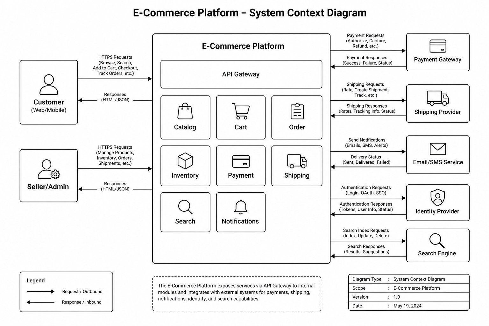

# E-commerce Platform Architecture Design Document

## Table of Contents

1. [Introduction](#1-introduction)
2. [Business Requirements](#2-business-requirements)
3. [Functional Requirements](#3-functional-requirements)
4. [Non-Functional Requirements](#4-non-functional-requirements)
5. [Domain Analysis (DDD)](#5-domain-analysis-ddd)
6. [High-Level Architecture](#6-high-level-architecture)
7. [Core Components / Services](#7-core-components--services)
8. [Database Design](#8-database-design)
9. [API Design](#9-api-design)
10. [Communication Patterns](#10-communication-patterns)
11. [Scalability Strategy](#11-scalability-strategy)
12. [Performance Considerations](#12-performance-considerations)
13. [Security Considerations](#13-security-considerations)
14. [Reliability & Fault Tolerance](#14-reliability--fault-tolerance)
15. [Deployment Strategy](#15-deployment-strategy)
16. [Monitoring & Observability](#16-monitoring--observability)
17. [Trade-offs & Design Decisions](#17-trade-offs--design-decisions)
18. [Future Improvements](#18-future-improvements)
19. [Conclusion](#19-conclusion)

---

# 1. Introduction

## Overview

This document describes the architecture of a modern, cloud-native E-commerce Platform designed to support millions of customers, thousands of concurrent sellers, and high transaction volumes across web and mobile channels.

The platform enables customers to browse products, search catalogs, manage shopping carts, place orders, make secure payments, and track deliveries. It also provides operational capabilities for inventory management, pricing, promotions, customer support, and order fulfillment. Sellers and administrators interact with the same backend capabilities through controlled APIs and internal tools.

The architecture emphasizes scalability, resilience, maintainability, and security while supporting continuous feature delivery through independently deployable services. Seasonal demand patterns—such as Black Friday and Cyber Monday—are treated as first-class design drivers rather than exceptional edge cases.

Although this document uses an online retail platform as the reference domain, the architectural principles can be applied to many transaction-intensive enterprise systems where catalog browsing, reservation of constrained resources, payment orchestration, and asynchronous side effects must coexist.

### System Context

The platform sits between customer-facing channels, internal operators, and external providers. Customers and sellers access business capabilities through an API gateway. Payment gateways, shipping providers, notification services, identity providers, and search infrastructure are treated as supporting systems outside the core domain ownership boundary.

| Actor / System | Type | Relationship to the Platform |
|----------------|------|------------------------------|
| Customer (Web / Mobile) | Primary actor | Browses catalog, manages cart, places orders, tracks deliveries |
| Seller / Admin | Primary actor | Manages products, inventory, pricing, promotions, and order exceptions |
| Payment Gateway | External system | Authorizes and captures payments; reduces PCI scope inside the platform |
| Shipping Provider | External system | Receives fulfillment requests and returns shipment status updates |
| Email / SMS Service | External system | Delivers transactional and operational notifications |
| Identity Provider | External system | Authenticates customers and internal users; issues tokens consumed at the edge |
| Search Engine | Supporting system | Indexes catalog data and serves low-latency product discovery queries |

---

## Goals

The primary goals of the architecture are to:

- Support millions of registered users and large concurrent browsing sessions
- Handle seasonal traffic spikes (for example Black Friday) without degrading checkout reliability
- Maintain high availability with minimal downtime for storefront-critical paths
- Enable independent development and deployment of business capabilities
- Ensure secure payment processing with clear isolation of sensitive payment data
- Provide near real-time inventory updates across channels and regions
- Deliver responsive user experiences for search, catalog, cart, and checkout flows
- Support horizontal scalability of read- and write-intensive services independently
- Simplify long-term maintenance and evolution through clear domain boundaries
- Isolate failures so that degradation in one capability does not cascade across the platform

---

## Architectural Approach

The platform adopts a domain-oriented microservices architecture based on Domain-Driven Design (DDD). Business capabilities are separated into independently deployable services, each owning its data and business rules. Cross-cutting concerns such as authentication, routing, rate limiting, and observability are handled at the platform level rather than being re-implemented inside every service.

Key architectural principles include:

| Principle | Role in this Platform |
|-----------|------------------------|
| Domain-Driven Design (DDD) | Aligns service boundaries with business capabilities and ubiquitous language |
| Clean Architecture | Keeps domain logic independent of frameworks, databases, and transport details |
| Microservices | Enables independent scaling, deployment, and team ownership |
| Event-Driven Communication | Decouples side effects such as notifications, analytics, and fulfillment triggers |
| CQRS (where justified) | Separates write models for orders/inventory from optimized catalog and search reads |
| API Gateway Pattern | Provides a single entry point for routing, authn/authz, and cross-cutting policies |
| Database per Service | Prevents hidden coupling through shared databases |
| Cloud-Native Deployment | Uses containers, managed infrastructure, and elastic capacity |
| Observability by Design | Treats logs, metrics, and traces as required runtime contracts |

These patterns were selected to balance scalability, team autonomy, fault isolation, and long-term maintainability. They are not applied indiscriminately: synchronous request/response remains appropriate for user-facing reads and for strongly consistent local transactions inside a service boundary. Event-driven flows are preferred when work can be completed asynchronously and when temporary inconsistency is acceptable.

---

## Intended Audience

This document is intended for:

- Software Engineers
- Senior Developers
- Technical Leads
- Solution Architects
- Engineering Managers
- Students learning enterprise software architecture

Readers are expected to use this document as a design reference for implementation planning, design reviews, and onboarding—not as a product tutorial.

---

## Scope

The architecture covers the following business domains:

| Domain | Responsibility Summary |
|--------|------------------------|
| Customer Management | Customer profiles, preferences, and account lifecycle |
| Product Catalog | Product information, categories, pricing presentation inputs |
| Inventory | Stock levels, reservations, and availability decisions |
| Shopping Cart | Cart creation, item updates, and checkout preparation |
| Orders | Order placement, state transitions, and order history |
| Payments | Payment orchestration and integration with payment providers |
| Shipping | Fulfillment handoff and shipment tracking integration |
| Notifications | Customer and operational messaging triggered by domain events |
| Search | Product discovery, indexing, and query serving |
| Reviews | Ratings and review moderation workflows |
| Authentication & Authorization | Identity integration, roles, and access control |
| Administration | Back-office operations for catalog, orders, and configuration |

External integrations such as payment gateways, shipping providers, email services, and search engines are considered supporting systems. The platform defines integration contracts and ownership boundaries for these systems but does not own their internal implementations.

---

## Out of Scope

The following topics are intentionally excluded from this document:

- Front-end implementation details
- UI/UX design
- Infrastructure provisioning scripts
- CI/CD pipeline implementation details
- Vendor-specific cloud configuration runbooks
- First-mile supplier procurement systems
- In-store point-of-sale (POS) and physical store operations

These areas may be documented separately where appropriate. Later sections reference integration needs and operational constraints without prescribing frontend frameworks or a specific cloud vendor’s control-plane configuration.

---

## Document Conventions

- Requirements and decisions are written for a production enterprise system, including trade-offs and alternatives.
- Diagrams in `assets/` complement the narrative; Mermaid diagrams may be used inline where they improve clarity.
- Section 18 is titled **Future Improvements** to reflect planned evolution beyond the baseline architecture described here.

---

<!-- Sections 2–19 will be added after review of Section 1. -->
