# Mobility & Delivery Platform — Enterprise Architecture

**Architecture Design Document (ADD)**

A simple, production architecture for **rides** and **package delivery** on one platform. Shared location, matching, pricing, payment, and notifications. Separate trip and delivery rules.

Reference product: **MobilityFlow**.

---

## Table of Contents

1. [Introduction](#1-introduction)
2. [Business Requirements](#2-business-requirements)
3. [Functional Requirements](#3-functional-requirements)
4. [Non-Functional Requirements](#4-non-functional-requirements)
5. [Domain Analysis (DDD)](#5-domain-analysis-ddd)
6. [High-Level Architecture](#6-high-level-architecture)
7. [Core Components / Services](#7-core-components--services)
8. [Database Design](#8-database-design)
9. [API Design](#9-api-design)
10. [Communication Patterns](#10-communication-patterns)
11. [Scalability Strategy](#11-scalability-strategy)
12. [Performance Considerations](#12-performance-considerations)
13. [Security Considerations](#13-security-considerations)
14. [Reliability & Fault Tolerance](#14-reliability--fault-tolerance)
15. [Deployment Strategy](#15-deployment-strategy)
16. [Monitoring & Observability](#16-monitoring--observability)
17. [Trade-offs & Design Decisions](#17-trade-offs--design-decisions)
18. [Future Improvements](#18-future-improvements)
19. [Conclusion](#19-conclusion)

---

# 1. Introduction

## What we are building

MobilityFlow is a two-sided marketplace:

- **Mobility** — passenger ride-hailing
- **Delivery** — package courier
- **Shared platform** — identity, location, matching, pricing, payment, notification

Ride-hailing is the core MVP. Courier is in the same MVP because both products use the same drivers and the same dispatch pipeline. We are **not** building food delivery, grocery, freight, or the rest of the Uber catalog.

**One sentence:** share the pipes (location, matching, pay); keep the products (Trip vs Delivery) separate.

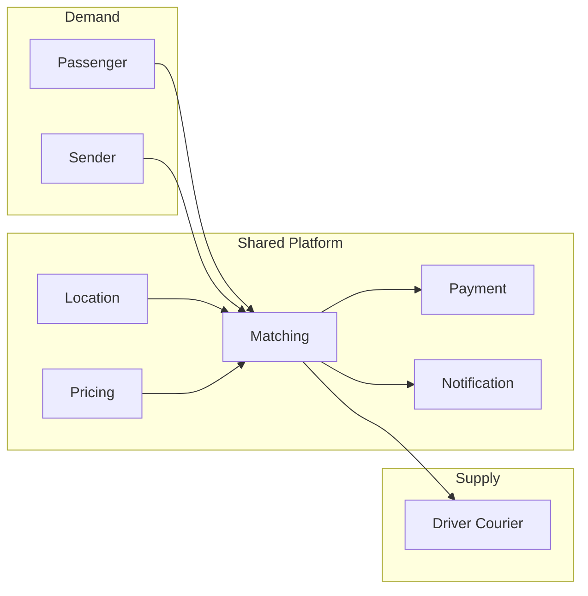

---

## System context

Clients talk only to the edge. Maps, card processing, and push are outside the platform.

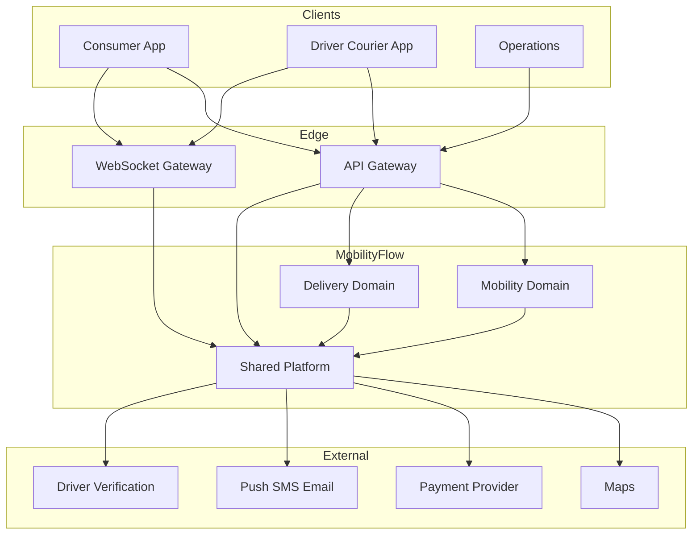

| Who | Talks to the platform to |
|-----|--------------------------|
| Consumer App | Request a ride or delivery, track, pay, rate |
| Driver / Courier App | Go online, stream GPS, accept offers, complete jobs |
| Operations | Disputes, safety, driver verification exceptions |
| Maps | Distance, ETA, routes |
| Payment Provider | Authorize and capture (we never store raw cards) |
| Push / SMS / Email | Offers, status, receipts |

---

## Architecture in four layers

Keep this picture in your head. Everything else is a walk through these layers.

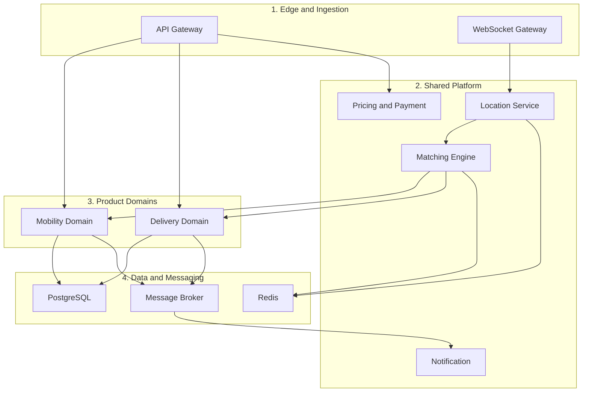

| Layer | Components | What it does |
|-------|------------|----------------|
| Edge and ingestion | API Gateway, WebSocket Gateway | JWT auth, REST routing, persistent driver telemetry |
| Shared platform | Location, Matching, Pricing and Payment, Notification | Driver spatial index in Redis H3, policy-based dispatch, payment orchestration |
| Product domains | Mobility, Delivery | Product rules: passenger trips vs packages with proof of delivery |
| Data and messaging | PostgreSQL, Redis, RabbitMQ or Kafka | Postgres = system of record. Redis = hot supply. Broker = async events |

REST is for requests the user is waiting on (quote, request, accept). WebSockets are for GPS and live tracking. The broker is for work that can wait (push, receipts, payment capture).

---

## MVP — what ships

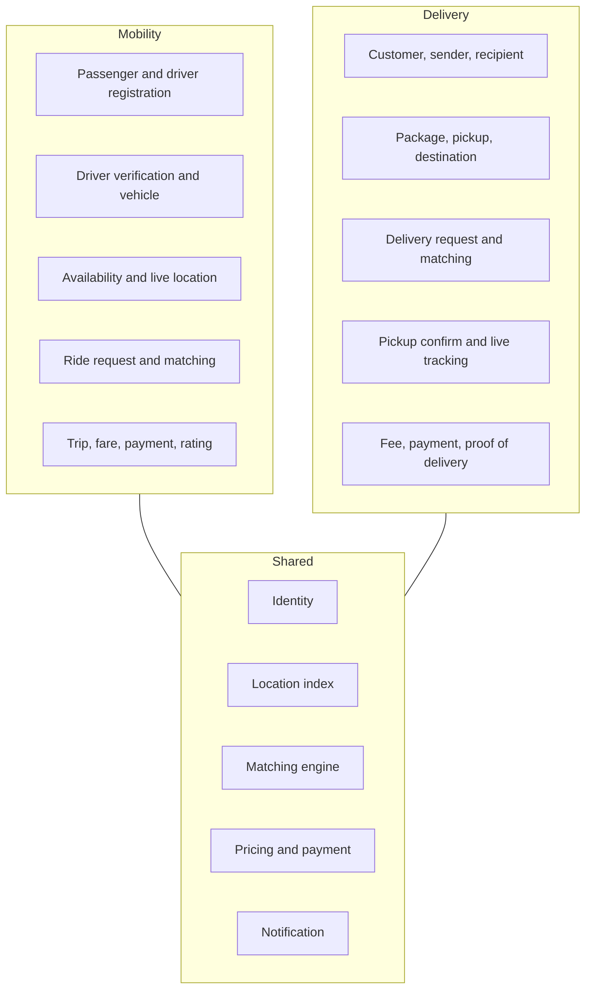

Not in MVP: food delivery, grocery, freight, transit, shared rides, scheduled rides, multi-region active-active.

---

## How a job actually runs

Three pipelines. Same for rides and deliveries. Only the last step (completion) differs.

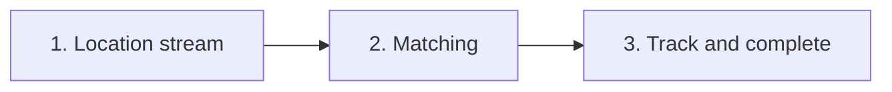

### 1. Location telemetry

Drivers send GPS every 4–5 seconds. That traffic never hits PostgreSQL on the write path.

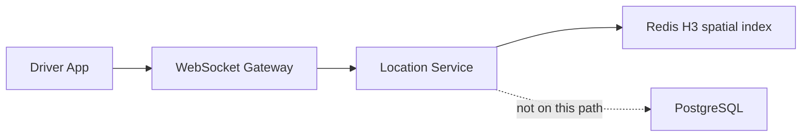

| Step | What happens |
|------|----------------|
| Stream | Driver App sends GPS over the WebSocket Gateway |
| Validate | Location Service checks coordinates |
| Index | Write to Redis geospatial index (H3) for fast nearby lookup |
| Skip SQL | High-frequency pings stay in memory. Postgres is not on this write path |

Postgres gets location only as a snapshot when a job completes, or in a later batch. That keeps GPS from becoming a database bottleneck.

### 2. Low-latency matching

A passenger or sender requests a job over HTTP. Matching uses Redis, not a SQL scan of every driver.

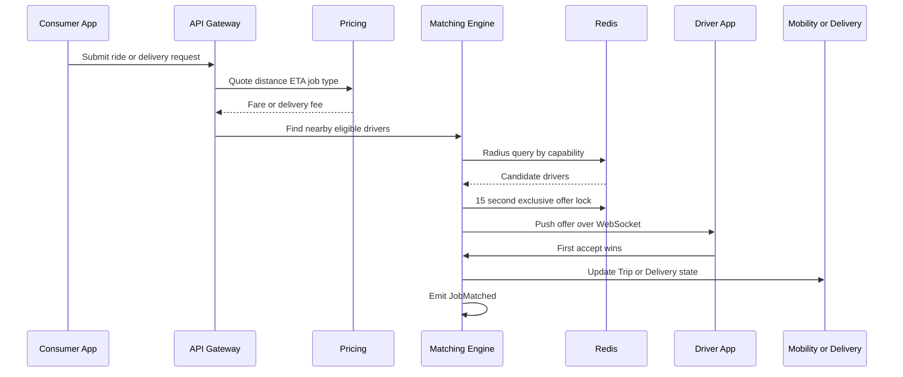

| Step | What happens |
|------|----------------|
| Trigger | Passenger or sender submits a request over REST |
| Price | Deterministic quote from distance, ETA, and job-type coefficients |
| Spatial query | Matching Engine queries Redis for nearby drivers filtered by capability (car, van, courier) |
| Offer | Exclusive offer over WebSocket, 15-second lock in Redis |
| Accept | First accept wins the lock, domain state updates, `JobMatched` is emitted |

Rides and deliveries use this same engine. Eligibility and completion rules stay in the product domain.

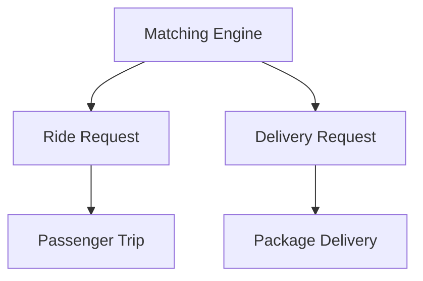

| | Ride | Courier |
|---|------|---------|
| Customer | Passenger | Sender |
| Provider | Driver | Driver / courier |
| Goal | Move a person | Move a package |
| Vehicle filter | Car, bike, ... | Bike, car, van, ... |
| Tracking key | Trip ID | Delivery ID |
| Done when | Passenger drop-off | Proof of delivery |

Do **not** put both products in one `Job` table. Share the index and the offer pipeline. Keep Trip and Delivery as separate records.

### 3. Live tracking and completion

While the job is in progress, GPS is forwarded to the consumer over a WebSocket channel keyed by Trip ID or Delivery ID.

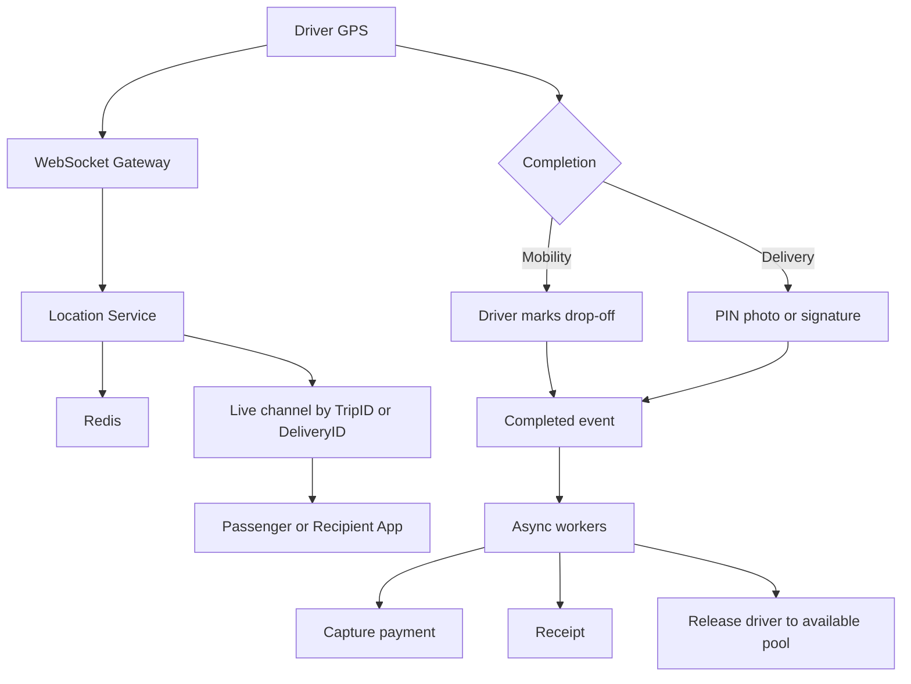

| Step | What happens |
|------|----------------|
| Live broadcast | In-transit GPS goes to the consumer on a channel keyed by Trip ID or Delivery ID |
| Mobility complete | Driver marks drop-off at the destination |
| Delivery complete | Driver uploads proof of delivery (PIN, photo, or signature) |
| After | Background workers capture the pre-authorized payment, send the receipt, and put the driver back in the available pool |

Notifications, receipts, and payment capture are async. Core state change (matched, picked up, completed) stays on the request path, targeting **under 100ms**.

---

## Domain state — two products, two machines

Shared matching. Separate aggregates and completion rules.

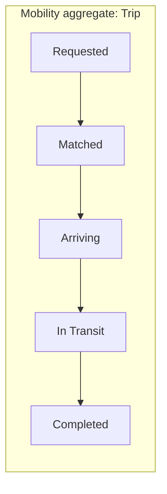

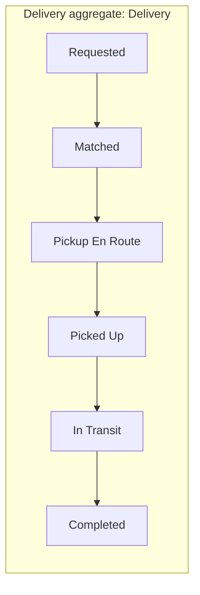

| Domain | Core record | Lifecycle | Done when |
|--------|-------------|-----------|-----------|
| Mobility | Trip | Requested → Matched → Arriving → In Transit → Completed | Passenger drop-off confirmed |
| Delivery | Delivery | Requested → Matched → Pickup En Route → Picked Up → In Transit → Completed | Proof-of-delivery artifact validated |

---

## Three rules that keep this simple

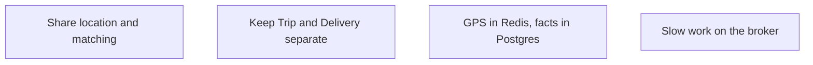

1. **Share the kernel, isolate the records.** One location index and one matching pipeline. No single `Job` table that mixes passenger safety rules with parcel proof of delivery.
2. **Offload telemetry.** GPS stays in Redis. Write to Postgres on job completion (and optional later snapshots).
3. **Async the side effects.** Push, receipts, and payment capture run on workers so the state transition stays fast.

---

## How it is deployed at launch

One region. A few services. Not thirty microservices.

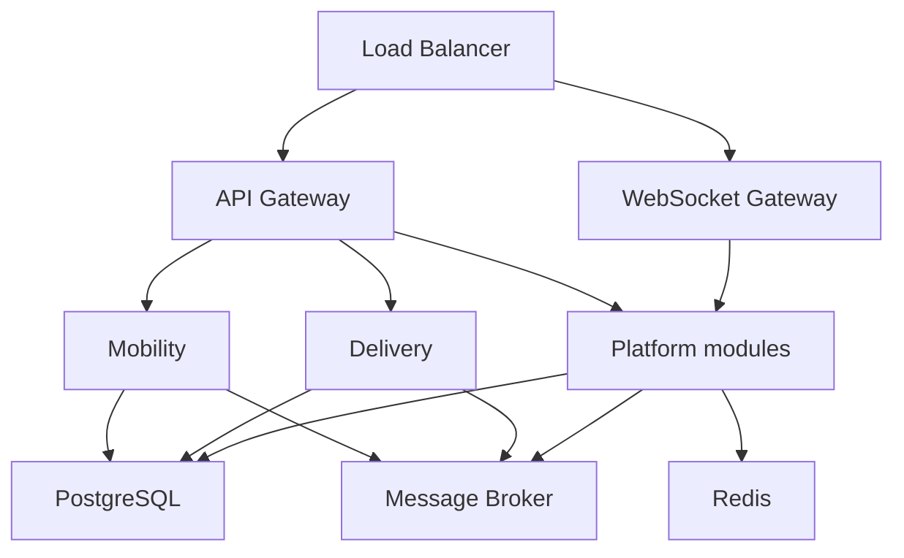

| Stage | When | Shape |
|-------|------|--------|
| 1. Launch | First city | One region, one primary Postgres, Redis, broker, several API instances |
| 2. Growth | Traffic rises | More API nodes, read replicas, workers, rate limits, better dashboards |
| 3. Large scale | Many cities | Regional routing, regional data and matching, sharding, failover |

Stage 1 is the default in this document. Later sections say what changes at Stage 2 and 3 — not a rewrite of Trip or Delivery.

---

## Goals

- Ship rides **and** courier in one region, as a real production system
- Reuse location, matching, pricing, payment, and notification
- Keep Trip and Delivery rules separate
- Match nearby eligible drivers quickly
- Never lose an in-progress trip or delivery on app crash
- Complete rides on drop-off; complete deliveries on proof of delivery
- Pay without storing raw card data
- Scale later (replicas, then regions) without changing the domain meanings

---

## Intended audience

Software engineers, tech leads, architects, and engineering managers on this team. Use this for design reviews and onboarding — not as an interview cheat sheet.

---

## Scope

| Area | Owns |
|------|------|
| Identity | Signup, login, roles (passenger, sender, driver, ops) |
| Location | Driver GPS index, pickup and drop points |
| Matching | Nearby supply, offers, locks, re-match |
| Pricing | Ride fare and delivery fee |
| Payment | Authorize, capture, refund via the provider |
| Notification | Push, SMS, email from domain events |
| Mobility | Passenger, vehicle for rides, Ride request, Trip, rating |
| Delivery | Sender, recipient, package, Delivery, proof of delivery, rating |

---

## Out of scope

- Mobile UI implementation
- Food delivery, grocery, freight, transit, pool rides, scheduled rides
- Building our own maps or card processor
- Multi-region active-active (Stage 3)
- Cloud vendor runbooks and CI/CD internals

---

## How we record decisions

| Step | Meaning |
|------|---------|
| Problem | What hurts |
| MVP solution | What we ship now |
| Why | Why that is enough now |
| Scaling problem | What breaks later |
| Evolution | Next architecture, same domain |
| Trade-off | What we gain and what gets harder |

Example:

- **Problem:** GPS every few seconds would crush Postgres.
- **MVP:** Redis H3 for live location.
- **Why:** Launch traffic does not need a GPS history database on the hot path.
- **Later:** Snapshots and regional indexes.
- **Trade-off:** Fast matching; weaker historical GPS until we add snapshots.

---

## Document conventions

- **MobilityFlow** = the product. **Platform** = shared capabilities. **Mobility** / **Delivery** = product domains (not automatically separate deployables).
- Stage 1 is the default. Stages 2 and 3 appear when a section talks about growth.
- Diagrams are the source of truth for flows. Tables hold the rules.
- Section 5 will deepen Trip vs Delivery. Section 11 will deepen scale.

---

<!-- Sections 2–19 will be added after review of Section 1. -->
