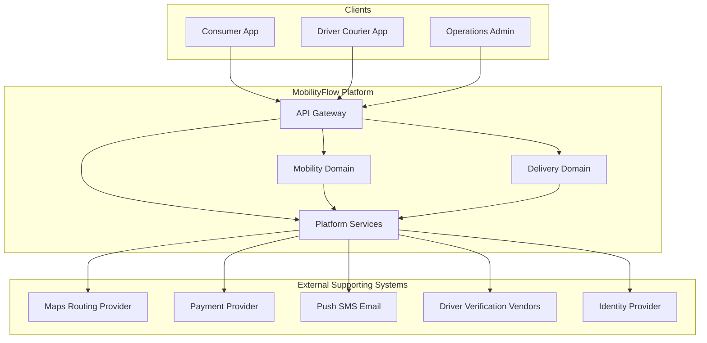

# Mobility & Delivery Platform — Enterprise Architecture

**Architecture Design Document (ADD)**

This is not a system-design interview answer. It is a production Architecture Design Document for a **multi-business-model marketplace**: passenger transportation and package delivery on one platform, sharing identity, location, matching, pricing, payment, and notification—without collapsing both products into a generic “God Service.”

The reference product name used in this document is **MobilityFlow**.

---

## Table of Contents

1. [Introduction](#1-introduction)
2. [Business Requirements](#2-business-requirements)
3. [Functional Requirements](#3-functional-requirements)
4. [Non-Functional Requirements](#4-non-functional-requirements)
5. [Domain Analysis (DDD)](#5-domain-analysis-ddd)
6. [High-Level Architecture](#6-high-level-architecture)
7. [Core Components / Services](#7-core-components--services)
8. [Database Design](#8-database-design)
9. [API Design](#9-api-design)
10. [Communication Patterns](#10-communication-patterns)
11. [Scalability Strategy](#11-scalability-strategy)
12. [Performance Considerations](#12-performance-considerations)
13. [Security Considerations](#13-security-considerations)
14. [Reliability & Fault Tolerance](#14-reliability--fault-tolerance)
15. [Deployment Strategy](#15-deployment-strategy)
16. [Monitoring & Observability](#16-monitoring--observability)
17. [Trade-offs & Design Decisions](#17-trade-offs--design-decisions)
18. [Future Improvements](#18-future-improvements)
19. [Conclusion](#19-conclusion)

---

# 1. Introduction

## Overview

This document describes the architecture of **MobilityFlow**, a mobility and delivery platform in the same class as Uber: one supply network of drivers/couriers, two demand products (rides and packages), and a shared operational backbone.

Ride-hailing is the **core MVP**. Courier/delivery is an **intentional first extension of the same platform**, not a separate company and not a day-one clone of every Uber vertical (eats, grocery, freight, transit, reserve, shared rides). Implementing the full product catalog in the MVP would make the architecture unnecessarily complicated. Implementing *only* passenger rides would make the case study narrower than a modern mobility platform actually is.

The interesting architectural question is therefore:

> How can one platform support multiple business models—passenger transportation and package delivery—while sharing location, matching, pricing, payment, identity, and notification capabilities?

That question drives bounded-context design, shared kernel vs independent domains, reusable platform services, polymorphic workflows, and the explicit refusal to build one infinitely generic dispatch engine.

**MVP does not mean a toy system.** It means a defined initial scope, an architecture that can actually be built and operated in one region, and a documented path toward massive scale. The MVP already includes production concerns: authentication, driver verification, durable job state, payment orchestration, proof of delivery, retries, observability, and failure isolation. What it does *not* include is premature operational complexity: dozens of microservices, Kafka clusters, multi-region active-active databases, or Kubernetes sprawl before the traffic justifies them.

Later sections describe **three evolutionary stages**:

| Stage | Intent | Typical shape |
|-------|--------|----------------|
| Stage 1 — Initial MVP | Launch rides and courier in one region on shared platform services | API gateway, a small set of backend services, one primary SQL database, Redis, a message broker, multiple API instances |
| Stage 2 — Growing platform | Absorb rising traffic without rewriting the domains | Load balancing, horizontal API scaling, read replicas, distributed cache, background workers, async events, rate limiting, stronger observability |
| Stage 3 — Large scale | Serve global demand with geographic isolation | Multi-region routing, regional data and matching, partitioning/sharding, distributed streaming, regional failover, global observability |

The same domain model is used throughout. What changes is deployment topology, data placement, and operational machinery—not the meaning of a Trip, a Delivery, a Fare, or a Match.

---

## Business Domain Map

The platform is structured as three business areas. Mobility and Delivery own product-specific workflows. Platform owns capabilities that both products must use consistently.

```text
                    MobilityFlow Platform
                           │
          ┌────────────────┼────────────────┐
          │                │                │
       Mobility         Delivery         Platform
          │                │                │
          ▼                ▼                ▼
    Ride Hailing       Courier          Identity
    Driver            Pickup/Drop       Payment
    Passenger         Delivery          Notification
    Trip              Tracking          Pricing
    Matching          Delivery Fee      Location
```

Matching appears under Mobility in the product sense (ride matching) and under Delivery (courier matching), but architecturally it is a **reusable platform capability** parameterized by job type. Section 5 will decide what belongs in a shared kernel versus what must stay inside each product context so the matching module does not become a God Service.

### Core marketplace loops

Both products follow the same *shape* of marketplace loop. The nouns and completion rules differ.

```text
Mobility                         Delivery
────────                         ────────
Registration                     Customer registration
     ↓                                ↓
Authentication                   Sender / recipient
     ↓                                ↓
Passenger / Driver               Pickup / destination / package
     ↓                                ↓
Ride Request                     Delivery Request
     ↓                                ↓
Driver Matching                  Courier / driver matching
     ↓                                ↓
Trip                             Pickup → in transit → drop
     ↓                                ↓
Fare                             Delivery fee
     ↓                                ↓
Payment                          Payment
     ↓                                ↓
Rating                           Proof of delivery + rating
```

---

## MVP Scope

The initial production version includes both products. It does **not** include every adjacent Uber-class line of business.

### Mobility

- Passenger registration
- Driver registration
- Driver verification
- Vehicle management
- Driver availability
- Real-time location
- Ride request
- Driver matching
- Trip lifecycle
- Fare calculation
- Payment
- Rating

### Courier / Delivery

- Customer registration
- Sender / recipient information
- Pickup location
- Delivery destination
- Package information
- Delivery request
- Courier/driver matching
- Pickup confirmation
- Real-time delivery tracking
- Delivery status
- Delivery fee
- Payment
- Proof of delivery

### Shared by both (Platform)

- Identity and roles
- Location ingestion and geospatial queries
- Matching engine (job-type specific policies)
- Pricing / fee calculation
- Payment orchestration
- Notification

Promotions, wallets at depth, surge at marketplace scale, multi-city active-active, food delivery (merchant/menu), grocery, freight, and transit are evolution concerns—not MVP blockers.

---

## The Architectural Problem: One Platform, Two Business Models

A naive design either (a) copies the entire ride stack for delivery, or (b) invents a single `Job` / `DispatchService` that hides passenger, package, fare, and proof-of-delivery behind flags. Both fail.

- **Duplication** doubles identity, location, payment, and ops tooling, then diverges.
- **Over-generic dispatch** produces a God Service: every new rule (car seats, package size, proof photo, recipient PIN) lands in one matching/trip module until nobody can change rides without breaking parcels.

The intended design reuses **platform capabilities** and keeps **product workflows** distinct:

```text
                    ┌─────────────────────┐
                    │    API Gateway      │
                    └──────────┬──────────┘
                               │
              ┌────────────────┼────────────────┐
              │                │                │
              ▼                ▼                ▼
        Mobility Domain   Delivery Domain   Platform
              │                │                │
        ┌─────┼─────┐      ┌───┼────┐      ┌───┼────┐
        │     │     │      │   │    │      │   │    │
       Ride  Trip Matching Delivery Tracking Identity
        │     │     │      │   │    │      Payment
        └─────┼─────┘      └───┼────┘      Pricing
              │                │           Notification
              └────────────────┼────────────────┘
                               │
                     Shared Platform Services
```

Matching is the clearest example of a reusable capability with **different policies**:

```text
                 Matching Engine
                       │
             ┌─────────┴─────────┐
             │                   │
        Ride Request       Delivery Request
             │                   │
             ▼                   ▼
       Passenger Ride       Package Delivery
```

| Capability | Ride | Courier |
|------------|------|---------|
| Customer | Passenger | Sender |
| Service provider | Driver | Courier / Driver |
| Primary objective | Transport passenger | Transport package |
| Matching | Driver ↔ Passenger | Courier ↔ Delivery |
| Vehicle | Car / bike / etc. | Bike / car / van / etc. |
| Destination | Passenger destination | Package destination |
| Tracking | Trip | Delivery |
| Completion | Passenger drop-off | Proof of delivery |

Same engine *shape* (nearby eligible supply, offer, accept/timeout, re-match). Different eligibility, SLA, tracking model, and completion invariant. Section 5 will treat this as shared kernel + policy, not as one polymorphic entity that owns both businesses.

---

## System Context

The platform sits between consumer and supply-side clients, internal operations, and external providers. Clients enter through an API gateway. Maps, payments, and push/SMS are supporting systems. The platform owns identity, matching, trip and delivery lifecycle, pricing, payment *orchestration*, and proof-of-delivery records—not card processing or road-network data.



| Actor / System | Type | Relationship to the Platform |
|----------------|------|------------------------------|
| Consumer App | Primary actor | Passenger rides and/or sender deliveries: request, track, pay, rate |
| Driver / Courier App | Primary actor | Goes online, receives ride or delivery offers, navigates, completes jobs, receives payouts |
| Recipient | Indirect actor | Receives packages; may confirm PIN / signature (delivery only) |
| Operations / Admin | Primary actor | Disputes, safety, driver verification exceptions, marketplace configuration |
| API Gateway | Platform edge | Authentication, routing, rate limiting, client-facing API composition |
| Mobility domain | Core product | Ride request, trip lifecycle, passenger-specific rules |
| Delivery domain | Core product | Delivery request, package, pickup/drop, proof of delivery |
| Platform services | Shared core | Identity, location, matching, pricing, payment, notification |
| Maps / Routing Provider | External system | Geocoding, ETA, routes, distance |
| Payment Provider | External system | Card/wallet processing; reduces PCI scope inside the platform |
| Push / SMS / Email | External system | Offers, trip/delivery updates, receipts, operational alerts |
| Driver Verification Vendors | External system | License, background, and vehicle checks used during onboarding |
| Identity Provider | Optional supporting system | Phone verification or SSO; the platform still owns roles and authorization |

---

## Goals

The primary goals of the architecture are to:

- Ship a **production-quality MVP** of ride-hailing **and** courier delivery, not a slide-deck architecture and not the entire Uber catalog
- Support **two business models** on one platform without duplicating identity, location, payment, or notification
- Keep mobility and delivery **workflows and invariants separate** so matching and job state do not become a God Service
- Match nearby eligible drivers/couriers with acceptable latency for an urban launch market
- Persist trip and delivery state durably so crashes and reconnects do not lose an in-progress job
- Complete rides on drop-off and deliveries on **proof of delivery**
- Orchestrate fares/fees and payment without storing raw card data
- Notify consumers and drivers/couriers as job state changes
- Scale **by evolution**: add replicas, caches, workers, and later regions when load and geography demand it
- Avoid premature microservices, multi-region data, and streaming platforms before they pay for their operational cost
- Isolate failures so that notification or analytics degradation does not block requesting or completing a job

---

## Architectural Approach

The design starts from the **business domain**, not from a catalog of infrastructure products. Domain-Driven Design identifies three areas—Mobility, Delivery, and Platform—then bounded contexts inside them. Service and data boundaries are derived from those contexts. Clean Architecture is applied *inside* each deployable unit so domain rules do not depend on frameworks, GPS providers, or payment SDKs.

**Shared kernel vs independent domains.** Location, identity, payment, and notification are candidates for a shared kernel or shared platform services: both products need the same facts (who is this user, where is this vehicle, did payment capture). Ride and Delivery remain independent domains: a Trip is not a Delivery with a flag. Matching is a reusable *capability* with product-specific policies, not a single `Job` aggregate that owns passenger safety rules and parcel proof-of-delivery.

**Polymorphic workflows, not polymorphic gods.** Both products offer → accept → track → complete → pay. The workflow engine can share orchestration patterns (timeouts, re-match, notifications). The aggregates, state machines, and completion rules stay product-owned. Later sections will call out where a shared process manager is justified and where it would be a mistake.

For the MVP, contexts do **not** each become a separately deployed microservice. A small number of backend services—Mobility, Delivery, and Platform (identity/location/matching/pricing/payment/notification modules)—sharing a well-modeled PostgreSQL database and using Redis and a message broker is enough to launch. Database-per-service, multi-region sharding, and a large event mesh are Stage 2–3 moves.

```text
                    API Gateway
                         │
          ┌──────────────┼──────────────┐
          │              │              │
    Consumer App   Driver/Courier    Operations
          │              │              │
          └──────────────┼──────────────┘
                         │
                  Backend Services
                         │
          ┌──────────────┼──────────────┐
          │              │              │
      Mobility       Delivery       Platform
          │              │              │
          └──────────────┼──────────────┘
                         │
                  PostgreSQL / SQL
                         │
                    Redis Cache
                         │
                  Message Broker
```

This is intentional. Thirty microservices, Kafka clusters, multiple databases, and Kubernetes fleets are not required to complete the first production ride or delivery. They *are* required later, and this document says when and why.

| Principle | Role in this Platform |
|-----------|------------------------|
| Domain-Driven Design (DDD) | Separates Mobility, Delivery, and Platform; defines Trip vs Delivery as different aggregates |
| Shared kernel / platform services | Reuses identity, location, matching, pricing, payment, notification without merging products |
| Avoid God Service | Matching and “job” APIs stay policy-driven; product invariants stay in their contexts |
| Clean Architecture | Keeps matching, fare, trip, and proof-of-delivery rules independent of maps and payment SDKs |
| Modular monolith → services | Few deployable units with clear modules; split when scale or team boundaries demand it |
| Two-sided marketplace | Consumer demand (ride or parcel) and supply (driver/courier) with different client contracts |
| Event-driven side effects | Message broker for notifications, receipts, analytics—not for the synchronous match decision |
| SQL as system of record (MVP) | PostgreSQL holds identity, trips, deliveries, and payments with transactions and indexes |
| Redis for hot, ephemeral state | Supply location, presence, rate limits, short-lived locks—not completed trip/delivery truth |
| Evolutionary architecture | Problem → MVP solution → Why → Scaling problem → Evolution → Trade-off |
| Observability by design | Match latency, offer accept, trip/delivery completion, PoD success, payment success from day one |

Synchronous request/response is used where the user is waiting: login, quote, ride/delivery request, offer accept/reject, live status. Asynchronous messaging is used where work can lag: push notifications, receipts, analytics, and (later) payout batching.

---

## Intended Audience

This document is intended for:

- Software Engineers
- Senior Developers
- Technical Leads
- Solution Architects
- Engineering Managers
- Students learning marketplace, geo-spatial, and multi-product platform architecture

Readers should treat this as a design reference for implementation planning, design reviews, and onboarding—not as an interview cheat sheet or a reverse-engineering of any specific vendor.

---

## Scope

Scope follows the business domains that Section 5 will analyze in depth. Technical capabilities such as location ingestion and matching sit in Platform or beside product contexts; they are not invented as infrastructure services ahead of the domain model.

### Mobility

| Domain | Responsibility Summary |
|--------|------------------------|
| Passenger | Passenger profile, payment methods (tokens), ride history |
| Driver (mobility view) | Eligibility for passenger trips, vehicle for rides |
| Ride | Ride request, matching attempts, cancellation before trip start |
| Trip | Accepted ride: pickup, en route, drop-off, completion |
| Rating (rides) | Two-sided ratings after trip completion |

### Delivery

| Domain | Responsibility Summary |
|--------|------------------------|
| Customer / Sender | Sender profile, recipient details, delivery history |
| Package | Size/weight/category constraints that affect matching and fee |
| Delivery | Request, assignment, pickup confirmation, in-transit, drop-off |
| Proof of Delivery | Photo, signature, or PIN as the completion invariant |
| Rating (deliveries) | Ratings after successful or failed delivery |

### Platform (shared)

| Domain | Responsibility Summary |
|--------|------------------------|
| Identity | Registration, authentication, sessions, roles (passenger, sender, driver/courier, ops) |
| Vehicle | Vehicles associated with a driver for a given period; capability tags (car, bike, van) |
| Location | Geospatial positions for supply and job pickup/drop; used by matching and tracking |
| Matching | Nearby eligible supply, offers, timeouts, re-match; policies per job type |
| Pricing | Ride fares, delivery fees, adjustments; (later) surge and promotions |
| Payment | Authorization, capture, refunds; orchestration with the payment provider |
| Notification | Push, SMS, and email triggered by domain events |
| Driver / Courier | Onboarding, verification, availability (online/offline), supply identity |
| Wallet | Driver/courier earnings—(limited in MVP) |
| Promotion | Coupons and incentives—identified as a context, largely future scope |

MVP implements the critical path through Mobility, Delivery, and Platform. Wallet depth, promotions, food-merchant delivery, and multi-region operations are future scope rather than omitted from the model.

---

## Out of Scope

The following are intentionally excluded from this ADD, or deferred beyond the architecture described here:

- Consumer and driver UI/UX implementation and mobile framework choices
- Full Uber-class catalog: food delivery (merchants/menus), grocery, freight, transit, helicopter, shared/pool rides, scheduled/reserve rides (except as future evolution)
- Autonomous vehicle dispatch
- In-house maps, road-graph, or turn-by-turn navigation engines
- In-house card processing / PCI Level 1 payment acquiring
- Driver background-check vendor internals and regulatory licensing operations
- International customs / cross-border parcel networks
- Infrastructure-as-code repositories and vendor-specific cloud runbooks
- CI/CD pipeline implementation details

These may be documented separately. Later sections reference integration contracts (maps, payments, push, verification) without prescribing a cloud vendor or a mobile stack.

---

## How This Document Treats Evolution

For every major architectural decision, later sections use a consistent structure:

| Step | Meaning |
|------|---------|
| **Problem** | The constraint that forces a decision |
| **MVP solution** | What we ship first, with enough production quality to operate |
| **Why** | Why that solution is sufficient *now* |
| **Scaling problem** | What breaks as volume, geography, products, or team size grow |
| **Evolution** | The next architecture, not a rewrite of the domain |
| **Trade-off** | What we gain and what complexity we accept |

Example (matching—expanded in Sections 5, 6, and 11):

- **Problem:** Rides and deliveries both need nearby eligible supply, but completion rules differ.
- **MVP solution:** One matching module with job-type policies; Trip and Delivery remain separate aggregates.
- **Why:** Launch does not justify two dispatch stacks or a universal Job God Service.
- **Scaling problem:** Policy explosion and hotspot supply in dense cities; mixed ride+delivery inventory contention.
- **Evolution:** Split matching workers by job type and region; keep a shared location index.
- **Trade-off:** Scale and isolation improve; cross-product supply optimization gets harder.

That pattern is the point of this repository: architectural thinking, not a single “final” diagram.

---

## Document Conventions

- Requirements and decisions are written for a production system, including trade-offs and alternatives.
- **MobilityFlow** is the reference product; the document title is the portfolio name of the case study.
- **Stage 1 / 2 / 3** refer to the evolution model above; Stage 1 is the default design unless a section explicitly discusses later stages.
- **Platform** means shared capabilities; **Mobility** and **Delivery** mean product domains—not necessarily separately deployed microservices in the MVP.
- Mermaid diagrams are used inline. Additional diagrams may be added under `assets/` as the ADD grows.
- Section 5 is the primary home for bounded contexts, shared kernel vs independent domains, aggregates, and state machines for Trip vs Delivery.
- Section 11 (Scalability Strategy) is the primary home for user → traffic → API → database → cache → location → matching → messaging → regional → global scaling.
- Section 18 is titled **Future Improvements** and covers product and architecture evolution beyond Stage 3 foundations (including additional verticals).

---

<!-- Sections 2–19 will be added after review of Section 1. -->
