# Mobility & Delivery Platform — Enterprise Architecture

**Architecture Design Document (ADD)**

A production-ready, scalable architecture for **rides** and **package delivery** on a unified platform. The system leverages shared capabilities (Auth, Location, Matching, Pricing, Payment, Notifications) while strictly isolating the specific business rules for trips and deliveries.

**Reference Product:** MobilityFlow

---

## Table of Contents

1. [Introduction & Vision](#1-introduction--vision)
2. [Core Design Principles](#2-core-design-principles)
3. [System Context & Scope](#3-system-context--scope)
4. [High-Level Architecture](#4-high-level-architecture)
5. [Unified Identity & Access Management](#5-unified-identity--access-management)
6. [The Core Job Lifecycle](#6-the-core-job-lifecycle)
7. [Deployment & Scaling Strategy](#7-deployment--scaling-strategy)
8. [Design Decision Records (ADR)](#8-design-decision-records-adr)
9. [Document Conventions & Roadmap](#9-document-conventions--roadmap)

---

## 1. Introduction & Vision

### What we are building

MobilityFlow is a two-sided marketplace connecting users with drivers:

* **Mobility:** Passenger ride-hailing.
* **Delivery:** Package courier services.
* **Shared Platform:** Centralized services for Auth, Location, Matching, Pricing, Payment, and Notifications.

**One-Sentence Summary:** One unified Auth system for all user types; shared location, matching, and payment infrastructure; strictly isolated domain rules for Trips and Deliveries.

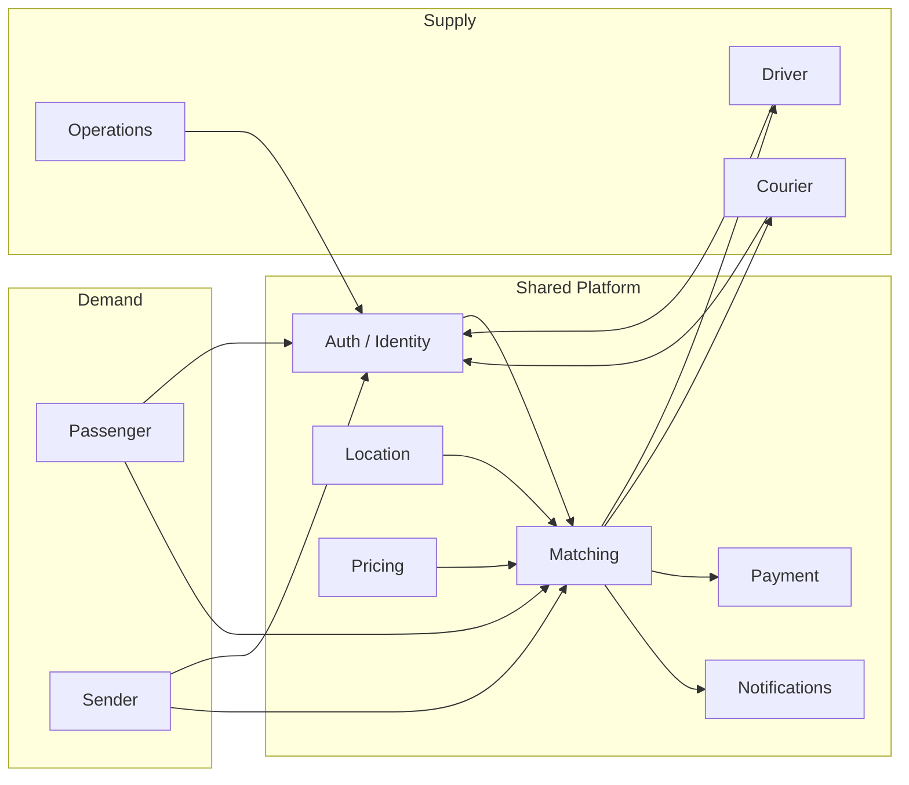

### Goals

* **Ship a Dual-Sided MVP:** Launch both rides and courier in a single region as a real production system.
* **Cost-Effective Scale:** Support **5K to 50K users** at launch with a lean footprint (one backend, one Postgres, one Redis, RabbitMQ).
* **Unified Identity:** One Auth/Identity platform managing passengers, senders, drivers, couriers, and operations.
* **High Availability:** Never lose an in-progress trip or delivery on app crash.
* **Future-Proofing:** Scale to millions of users (replicas, then regions) without changing core domain meanings.

---

## 2. Core Design Principles

These three rules govern all architectural decisions to keep the system simple and performant:

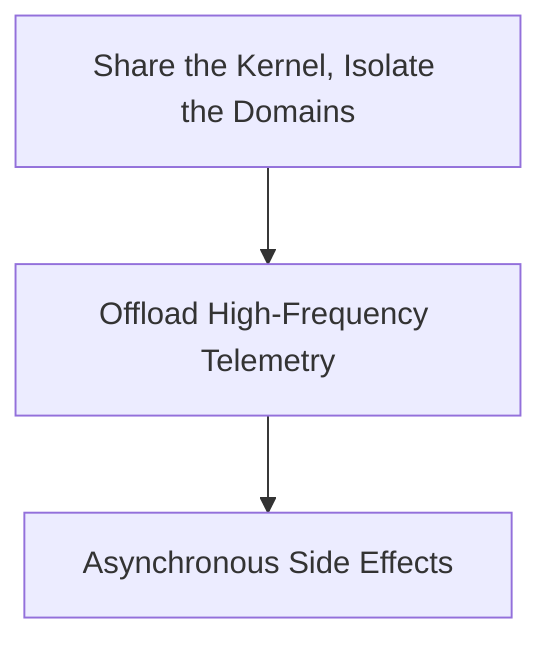

1. **Share the Kernel, Isolate the Domains:**
   One Auth service, one location index, one matching pipeline. User signup never happens inside the Mobility or Delivery domains. We avoid a single monolithic `Job` table that mixes passenger rules with proof-of-delivery logic.
2. **Offload High-Frequency Telemetry:**
   Driver GPS pings (every 4–5 seconds) are written to an in-memory spatial index (Redis/H3), not directly to the relational database. Postgres only receives location snapshots upon job completion.
3. **Asynchronous Side Effects:**
   Non-critical actions (push notifications, receipt generation, payment capture) are offloaded to background workers. This ensures the main transaction state transitions remain fast and low-latency.

---

## 3. System Context & Scope

### System Context

Clients communicate exclusively with the edge. Maps, card processing, and push notifications are external dependencies.

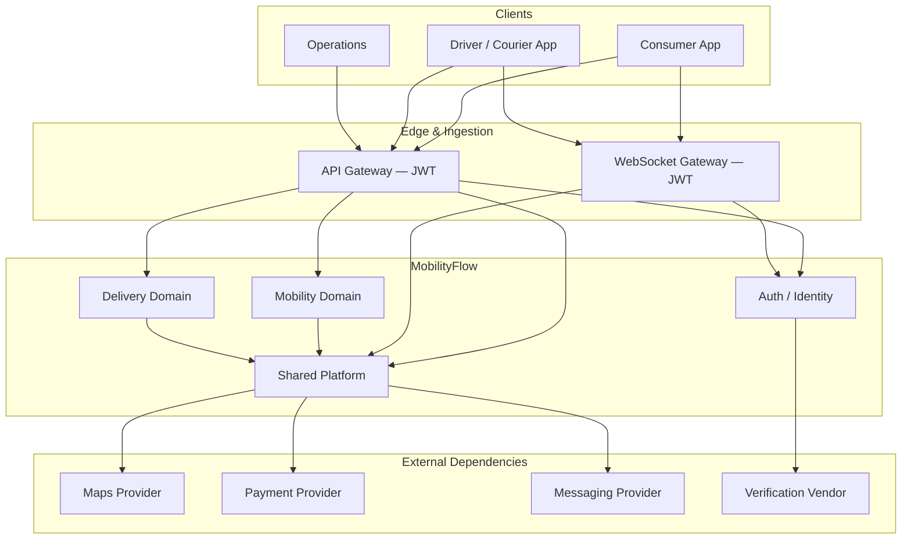

| Actor | Interaction with Platform |
| :--- | :--- |
| **Consumer App** | Register, verify phone, request job, track live, pay, rate. |
| **Driver / Courier App** | Register, complete KYC, go online, stream GPS, accept offers. |
| **Operations (Admin)** | Manage disputes, safety issues, manual KYC approvals. |
| **Maps Provider** | Distance calculation, ETA, routing. |
| **Payment Provider** | Authorize and capture funds (we never store raw card data). |
| **Messaging Provider** | OTP, push notifications, SMS, emails. |
| **Verification Vendor** | Background checks, license verification for drivers. |

### Scope & Out of Scope

| Area | Owned by Platform | Out of Scope |
| :--- | :--- | :--- |
| **Auth / Identity** | Register, OTP, login, JWT, role management, driver KYC. | Mobile UI implementation. |
| **Location** | Driver GPS spatial index, pickup/drop geocoding. | Building proprietary maps. |
| **Matching** | Nearby supply query, offer locks, re-match logic. | Scheduled rides, pool rides. |
| **Pricing & Payment** | Fare calculation, authorize/capture/refund via provider. | Building a custom payment gateway. |
| **Mobility Domain** | Trip lifecycle, ride-specific rules, ratings. | Food delivery, grocery, freight, transit. |
| **Delivery Domain** | Package lifecycle, proof of delivery (PIN/Photo), ratings. | Multi-region active-active (Reserved for Stage 3). |

---

## 4. High-Level Architecture

The system is divided into four distinct logical layers:

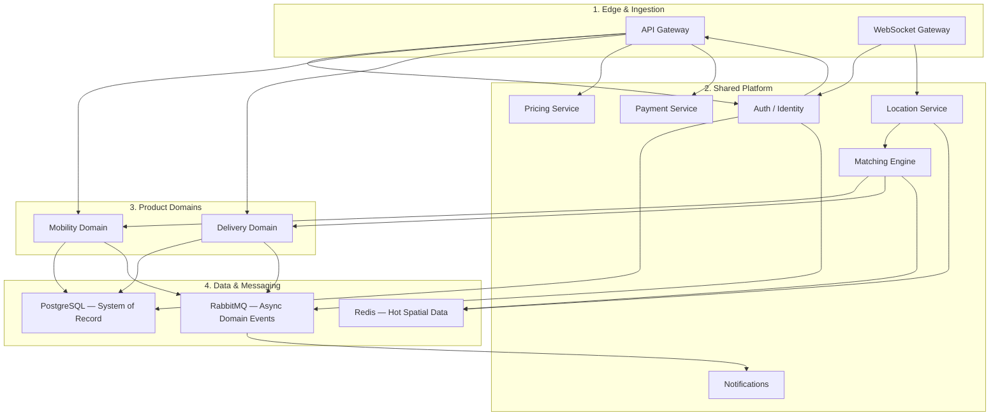

| Layer | Components | Responsibility |
| :--- | :--- | :--- |
| **1. Edge & Ingestion** | API Gateway, WebSocket Gateway | JWT validation, REST routing, persistent WebSocket sessions for live tracking. |
| **2. Shared Platform** | Auth, Location, Matching, Pricing, Payment, Notifications | Cross-cutting enterprise capabilities used by both product domains. |
| **3. Product Domains** | Mobility, Delivery | Specific business logic (e.g., passenger trip states vs. package proof-of-delivery). |
| **4. Data & Messaging** | PostgreSQL, Redis, RabbitMQ | Postgres (System of Record), Redis (Hot spatial data), RabbitMQ (Async domain events). |

No product API runs until Auth has issued a JWT and the gateway has validated it. REST handles user-facing requests; WebSockets carry GPS and live tracking; RabbitMQ handles work that can wait (OTP, push, receipts, payment capture).

---

## 5. Unified Identity & Access Management

Registration and verification live on the **Shared Platform**, not inside the product domains. The Auth service manages **one user** with **multiple roles**.

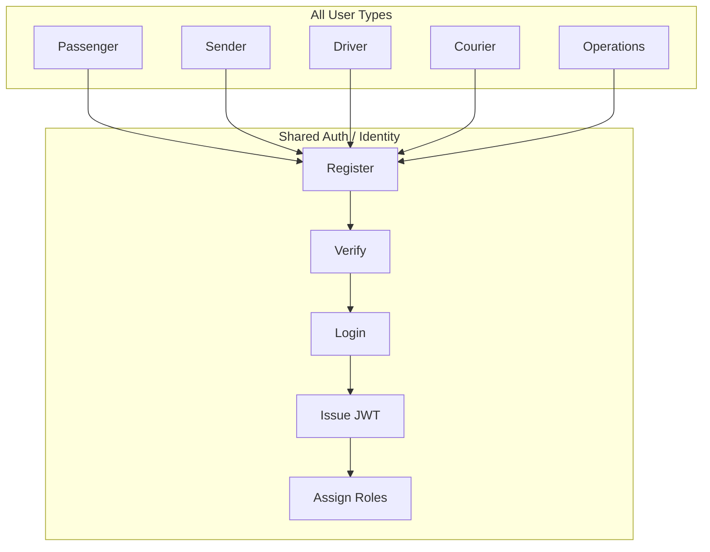

| User Type | App | Registration Requirements | Verification to Act |
| :--- | :--- | :--- | :--- |
| **Passenger** | Consumer | Phone, Name, Payment Token | Phone OTP |
| **Sender** | Consumer | Same account as Passenger | Phone OTP |
| **Driver** | Driver | Phone, Name, License, Vehicle | Phone OTP + License + Background + Vehicle Check |
| **Courier** | Driver | Same account as Driver | Same as Driver; vehicle must match parcel rules |
| **Operations** | Admin | Invite by existing admin | Email/SSO + MFA |

Same person can hold multiple roles (passenger + sender, or driver + courier). Auth stores **one user**, many **roles**.

*Note: Product domains only query Auth to verify: "Is this JWT allowed to request a ride / go online / approve KYC?"*

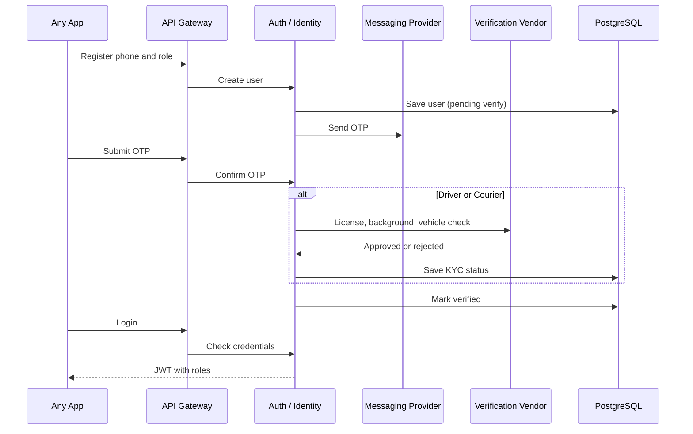

After login, every API call follows the same path:

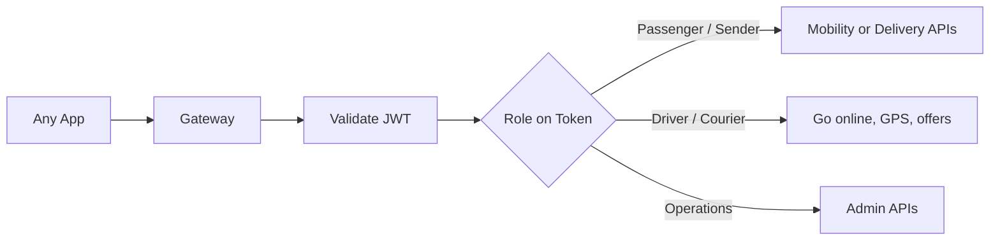

| Auth State | Meaning |
| :--- | :--- |
| **Registered** | Account exists; OTP not completed |
| **Verified** | Consumer may request rides or deliveries |
| **KYC Pending** | Driver or courier cannot go online |
| **KYC Approved** | Driver or courier may go online and receive offers |
| **Suspended** | Token rejected at the gateway |

---

## 6. The Core Job Lifecycle

*Note: We use the generic term **"Job"** to refer to either a Ride or a Delivery. The pipeline is identical until the completion phase.*

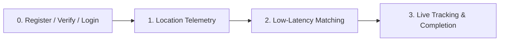

### Phase 1: Location Telemetry (Write Path)

Drivers stream GPS data every 4–5 seconds. This traffic bypasses PostgreSQL to prevent write bottlenecks.

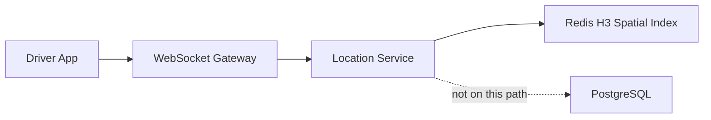

1. **Stream:** Driver App sends GPS coordinates over the WebSocket Gateway.
2. **Validate:** Location Service verifies coordinate bounds.
3. **Index:** Data is written to a Redis Geospatial Index (using H3) for fast nearby lookups.
4. **Skip SQL:** High-frequency pings stay in memory. Postgres only receives a snapshot when the job completes.

### Phase 2: Low-Latency Matching

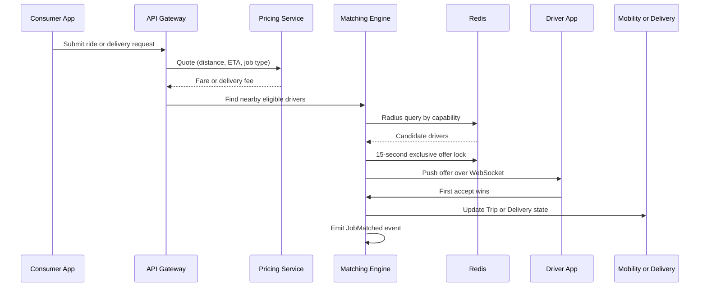

1. **Trigger:** User submits a request via REST API.
2. **Price:** Pricing Service calculates a deterministic quote (Distance + ETA + Job-Type Coefficients).
3. **Spatial Query:** Matching Engine queries Redis for nearby drivers, filtered by capability (car, van, courier).
4. **Offer & Lock:** An exclusive offer is sent via WebSocket. A **15-second lock** is placed in Redis.
5. **Accept:** The first driver to accept wins the lock. Domain state updates, and a `JobMatched` event is emitted to RabbitMQ.

Rides and deliveries share the matching engine. Eligibility and completion rules stay in the product domain.

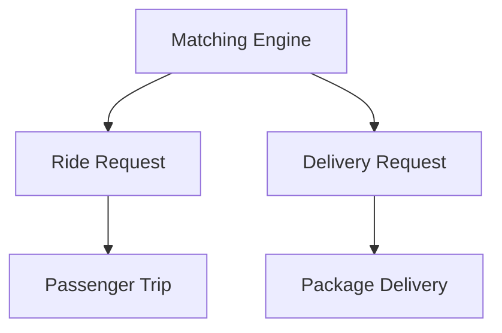

| | Ride | Courier |
| :--- | :--- | :--- |
| **Customer** | Passenger | Sender |
| **Provider** | Driver | Driver / Courier |
| **Goal** | Move a person | Move a package |
| **Vehicle filter** | Car, bike, … | Bike, car, van, … |
| **Tracking key** | Trip ID | Delivery ID |
| **Done when** | Passenger drop-off | Proof of delivery |

### Phase 3: Live Tracking & Completion

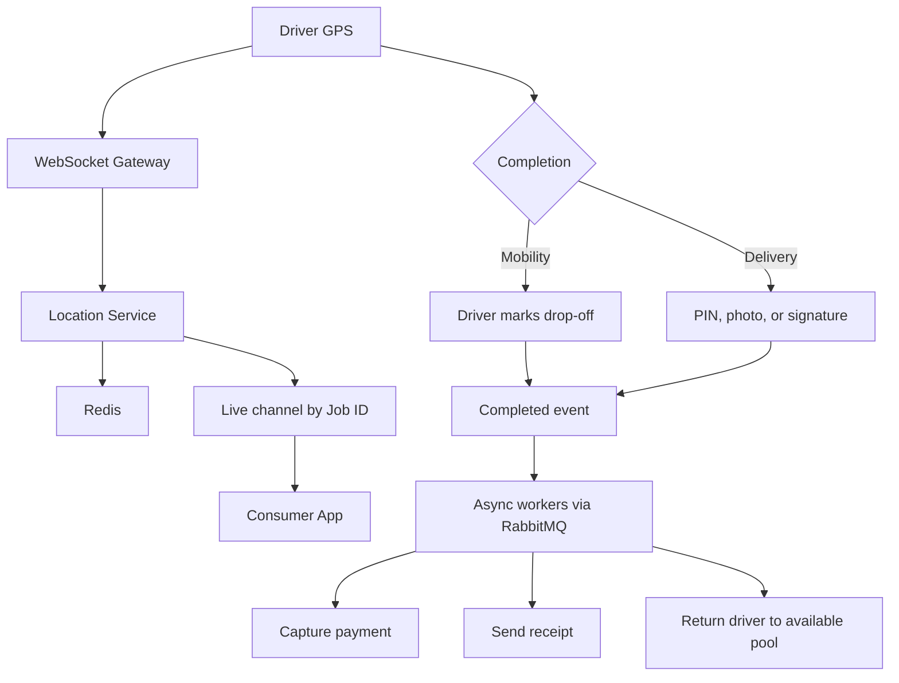

1. **Broadcast:** In-transit GPS is forwarded to the Consumer App on a WebSocket channel keyed by Job ID.
2. **Completion:**
   * *Mobility:* Driver marks drop-off at the destination.
   * *Delivery:* Driver uploads Proof of Delivery (PIN, photo, or signature).
3. **Post-Job Async:** Background workers capture the pre-authorized payment, send the receipt, and return the driver to the available pool.

Core state transitions (matched, picked up, completed) stay on the request path, targeting **under 100ms**. Notifications, receipts, and payment capture are async.

### Domain State — Two Products, Two State Machines

Shared matching pipeline. Separate aggregates and completion rules.

| Domain | Core Record | Lifecycle | Done When |
| :--- | :--- | :--- | :--- |
| **Mobility** | Trip | Requested → Matched → Arriving → In Transit → Completed | Passenger drop-off confirmed |
| **Delivery** | Delivery | Requested → Matched → Pickup En Route → Picked Up → In Transit → Completed | Proof-of-delivery artifact validated |

---

## 7. Deployment & Scaling Strategy

**Stage 1 Target:** 5K to 50K users. Keep the cloud bill small and operations simple. One region, one backend, one database.

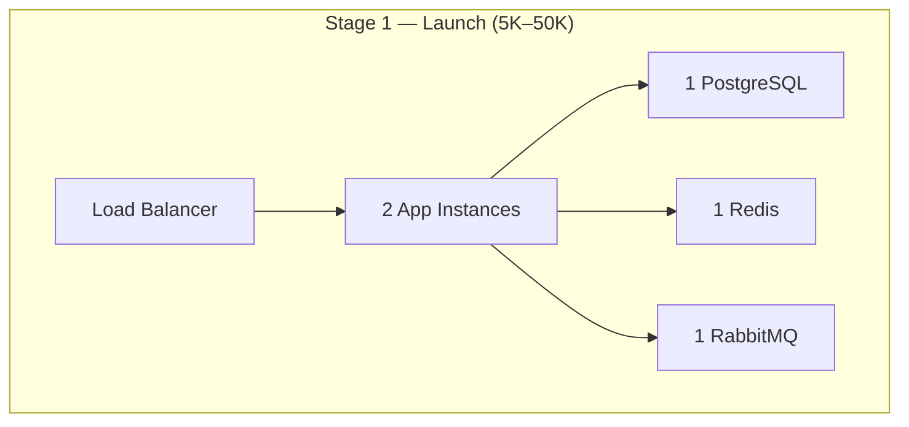

Inside the backend, modules remain separate in code (Auth, Mobility, Delivery, Location, Matching, Pricing, Payment, Notifications) but deploy as **one unit** at launch — not separate clusters.

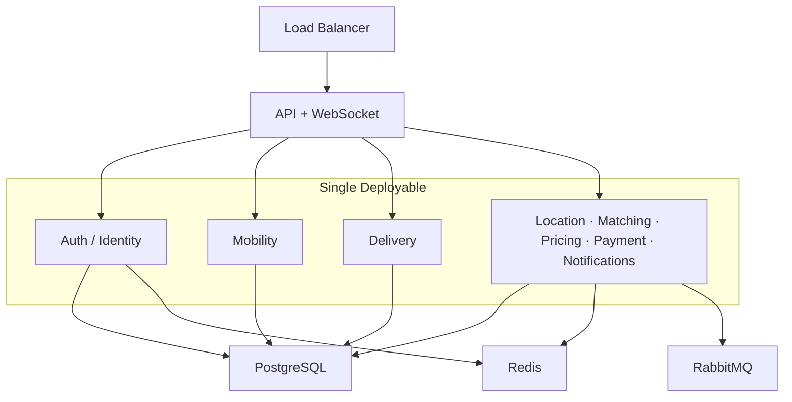

| Stage | User Scale | Infrastructure Shape |
| :--- | :--- | :--- |
| **Stage 1: Launch** | **5K – 50K** | 2 App Instances, 1 Postgres, 1 Redis, 1 RabbitMQ. Pay-as-you-go external APIs. |
| **Stage 2: Growth** | **50K – 500K** | Split hot services, Redis Cluster, Postgres Read Replicas, multiple API gateways. |
| **Stage 3: Scale** | **Millions** | Regional routing, regional data/matching silos, database sharding. |

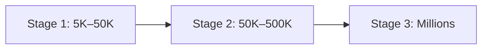

| Metric | Stage 1 | Stage 2 | Stage 3 |
| :--- | :--- | :--- | :--- |
| **Registered users** | 5K start, design for 50K | 50K – ~500K | Millions |
| **Concurrent apps open** | ~500 – 5K | Tens of thousands | Millions, by region |
| **Online drivers (GPS)** | ~200 – 2K | Tens of thousands | 100K+ per region |
| **Peak new jobs / min** | Tens to a few hundred | Thousands | Tens of thousands per region |

**Do not buy at Stage 1:** Kafka, Redis Cluster, Kubernetes multi-AZ microservices, read replicas, multi-region routing. Split only when 50K concurrent load actually hurts.

| Bottleneck (post-50K) | Why It Breaks |
| :--- | :--- |
| WebSocket instances | More drivers pinging every 4–5 seconds |
| Redis memory / CPU | Spatial index and offer locks |
| Postgres connections | Auth, trips, payments |
| Single region | Second city in another timezone |

---

## 8. Design Decision Records (ADR)

When documenting specific architectural choices in future sections, we use the following format:

* **Problem:** What is the bottleneck or pain point?
* **MVP Solution:** What are we shipping right now?
* **Why:** Why is this sufficient for the current stage?
* **Scaling Problem:** What will break when we grow?
* **Evolution:** What is the next architectural iteration?
* **Trade-off:** What do we gain, and what becomes harder?

*Example:*

> **Problem:** Writing GPS every 4 seconds will crush Postgres.
> **MVP Solution:** Use Redis H3 for live location.
> **Why:** Launch traffic doesn't require historical GPS on the hot path.
> **Scaling Problem:** Redis memory pressure at 100K+ concurrent drivers.
> **Evolution:** Batch GPS snapshots to Postgres; regional Redis silos.
> **Trade-off:** Extremely fast matching, but weaker historical GPS tracking until we implement batch snapshots.

---

## 9. Document Conventions & Roadmap

* **Terminology:** **MobilityFlow** = the product. **Platform** = shared capabilities. **Mobility / Delivery** = specific product domains.
* **Staging:** Stage 1 is the default baseline. Stages 2 and 3 are discussed only when addressing scale.
* **Diagrams vs Tables:** Diagrams are the source of truth for flows. Tables hold the business rules.

### Upcoming Sections (Roadmap)

*The following sections will be expanded in subsequent updates:*

| # | Section |
| :--- | :--- |
| 10 | Database Schema Design (ERD) |
| 11 | API Contracts (REST & WebSockets) |
| 12 | Scalability & Performance Deep-Dive |
| 13 | Security & Fault Tolerance |
| 14 | Monitoring, Observability & CI/CD |

---

<!-- Sections 10–14 follow the ADD template and will be added after review of Sections 1–9. -->
