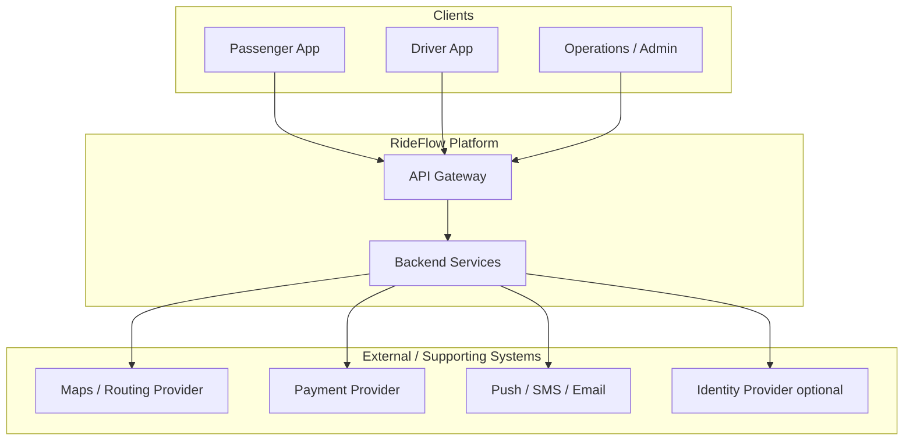

# RideFlow — Scalable Ride-Hailing Platform Architecture

**Architecture Design Document (ADD)**

This is not a system-design interview answer. It is a production Architecture Design Document for the first shippable version of a ride-hailing marketplace, plus a deliberate evolution path from that MVP to very large scale.

---

## Table of Contents

1. [Introduction](#1-introduction)
2. [Business Requirements](#2-business-requirements)
3. [Functional Requirements](#3-functional-requirements)
4. [Non-Functional Requirements](#4-non-functional-requirements)
5. [Domain Analysis (DDD)](#5-domain-analysis-ddd)
6. [High-Level Architecture](#6-high-level-architecture)
7. [Core Components / Services](#7-core-components--services)
8. [Database Design](#8-database-design)
9. [API Design](#9-api-design)
10. [Communication Patterns](#10-communication-patterns)
11. [Scalability Strategy](#11-scalability-strategy)
12. [Performance Considerations](#12-performance-considerations)
13. [Security Considerations](#13-security-considerations)
14. [Reliability & Fault Tolerance](#14-reliability--fault-tolerance)
15. [Deployment Strategy](#15-deployment-strategy)
16. [Monitoring & Observability](#16-monitoring--observability)
17. [Trade-offs & Design Decisions](#17-trade-offs--design-decisions)
18. [Future Improvements](#18-future-improvements)
19. [Conclusion](#19-conclusion)

---

# 1. Introduction

## Overview

This document describes the architecture of **RideFlow**, a two-sided ride-hailing marketplace in the same class as Uber: passengers request trips, nearby drivers are matched in real time, trips are tracked, fares are calculated, payments are collected, and both sides are notified throughout the lifecycle.

RideFlow is designed as a **realistic initial production system**, not a toy demo and not a day-one global platform. The first version must be implementable by a small engineering organization, operable in one region, and correct for the core marketplace loop:

```text
Registration
     ↓
Authentication
     ↓
Passenger / Driver
     ↓
Ride Request
     ↓
Driver Matching
     ↓
Trip
     ↓
Fare
     ↓
Payment
     ↓
Notification
```

That loop is the product. Everything else—promotions, multi-city expansion, advanced surge, rich analytics, driver incentives at marketplace scale—is an evolution concern, not an MVP blocker.

**MVP does not mean a toy system.** It means a defined initial scope, an architecture that can actually be built and operated, and a documented path toward massive scale. The MVP already includes production concerns: authentication, authorization, durable trip state, payment orchestration, retries, observability, and failure isolation. What it does *not* include is premature operational complexity: dozens of microservices, Kafka clusters, multi-region active-active databases, or Kubernetes sprawl before the traffic justifies them.

Later sections therefore describe **three evolutionary stages**:

| Stage | Intent | Typical shape |
|-------|--------|----------------|
| Stage 1 — Initial MVP | Launch the core marketplace in one region | API gateway, a small set of backend services, one primary SQL database, Redis, a message broker, multiple API instances |
| Stage 2 — Growing platform | Absorb rising traffic without rewriting the domain | Load balancing, horizontal API scaling, read replicas, distributed cache, background workers, async events, rate limiting, stronger observability |
| Stage 3 — Large scale | Serve global demand with geographic isolation | Multi-region routing, regional data and matching, partitioning/sharding, distributed streaming, regional failover, global observability |

The same domain model is used throughout. What changes is deployment topology, data placement, and operational machinery—not the meaning of a Ride, a Trip, or a Fare.

Although RideFlow is the reference product, the same architectural thinking applies to other real-time, geo-spatial marketplaces: food delivery, courier dispatch, and on-demand field services.

### System Context

RideFlow sits between two mobile clients, internal operations, and a small set of external providers. Passengers and drivers never talk to domain services directly; they enter through an API gateway. Maps, payments, and push/SMS are supporting systems. The platform owns identity, matching, trip lifecycle, pricing, and payment *orchestration*—not card processing or road-network data.



| Actor / System | Type | Relationship to the Platform |
|----------------|------|------------------------------|
| Passenger App | Primary actor | Registers, requests rides, tracks trips, pays, rates drivers |
| Driver App | Primary actor | Registers, goes online, receives offers, navigates, completes trips, receives payouts |
| Operations / Admin | Primary actor | Handles disputes, safety incidents, driver onboarding exceptions, and marketplace configuration |
| API Gateway | Platform edge | Authentication, routing, rate limiting, and client-facing API composition |
| Identity capability | Core platform | Registration, login, roles (passenger / driver / ops), session and token lifecycle |
| Ride / matching capability | Core platform | Ride requests, driver offers, trip state, cancellation, completion |
| Driver / location capability | Core platform | Driver availability, vehicle association, location updates used for matching |
| Pricing / fare capability | Core platform | Fare quotes, trip fare calculation, adjustments |
| Payment orchestration | Core platform | Authorizes/captures via a payment provider; owns RideFlow payment state, not card data |
| Maps / Routing Provider | External system | Geocoding, ETA, turn-by-turn routes, distance |
| Payment Provider | External system | Card/wallet processing; reduces PCI scope inside RideFlow |
| Push / SMS / Email | External system | Driver offers, trip updates, receipts, and operational alerts |
| Identity Provider | Optional supporting system | May own SSO or phone verification; RideFlow still owns authorization and roles |

---

## Goals

The primary goals of the architecture are to:

- Ship a **production-quality MVP** of the core ride marketplace, not a slide-deck architecture
- Keep the passenger and driver critical paths correct, observable, and operable in **one region**
- Match nearby available drivers with acceptable latency for an urban launch market
- Persist trip state durably so crashes, app kills, and reconnects do not lose an in-progress ride
- Orchestrate fare calculation and payment without storing raw card data
- Notify passengers and drivers as ride state changes
- Scale **by evolution**: add replicas, caches, workers, and later regions when load and geography demand it
- Avoid premature microservices, multi-region data, and streaming platforms before they pay for their operational cost
- Isolate failures so that notification or analytics degradation does not block requesting or completing a trip
- Leave clear extension points for promotions, wallets, multi-city launch, and regional matching

---

## Architectural Approach

The design starts from the **business domain**, not from a catalog of infrastructure products. Domain-Driven Design identifies the ubiquitous language and bounded contexts (Identity, Passenger, Driver, Ride, Trip, Location, Pricing, Payment, Notification). Service and data boundaries are derived from those contexts. Clean Architecture is applied *inside* each deployable unit so domain rules do not depend on frameworks, GPS providers, or payment SDKs.

For the MVP, those contexts do **not** each become a separately deployed microservice. A small number of backend services—initially Identity, Ride, and Driver, sharing a well-modeled PostgreSQL database and using Redis and a message broker—is enough to launch. Database-per-service, multi-region sharding, and a large event mesh are Stage 2–3 moves, justified when write contention, team ownership, or geography make them necessary.

```text
                    API Gateway
                         │
                ┌────────┴────────┐
                │                 │
          Passenger App      Driver App
                │                 │
                └────────┬────────┘
                         │
                  Backend Services
                         │
       ┌─────────────────┼─────────────────┐
       │                 │                 │
    Identity          Ride             Driver
    Service           Service          Service
       │                 │                 │
       └─────────────────┼─────────────────┘
                         │
                  PostgreSQL / SQL
                         │
                    Redis Cache
                         │
                  Message Broker
```

This is intentional. Thirty microservices, Kafka clusters, multiple databases, and Kubernetes fleets are not required to complete the first production ride. They *are* required later, and this document says when and why.

| Principle | Role in RideFlow |
|-----------|------------------|
| Domain-Driven Design (DDD) | Defines Ride, Trip, Driver availability, Fare, and Payment as domain concepts before choosing services |
| Clean Architecture | Keeps matching, fare, and trip invariants independent of maps, payments, and transports |
| Modular monolith → services | Starts with few deployable units and clear modules; splits when scale or team boundaries demand it |
| Marketplace dual-sidedness | Treats passenger demand and driver supply as one matching problem with different client contracts |
| Event-driven side effects | Uses a message broker for notifications, receipts, and analytics—not for the synchronous matching decision |
| SQL as system of record (MVP) | PostgreSQL holds identity, rides, trips, and payments with transactions and indexes |
| Redis for hot, ephemeral state | Driver location, presence, rate limits, and short-lived locks—not the source of truth for completed trips |
| API Gateway | Single entry for authn/authz, routing, and client-specific APIs |
| Evolutionary architecture | Documents Problem → MVP solution → Why → Scaling problem → Evolution → Trade-off for major decisions |
| Observability by design | Matching latency, offer acceptance, trip completion, and payment success are runtime contracts from day one |

Synchronous request/response is used where the user is waiting: login, fare quote, ride request, offer accept/reject, trip status. Asynchronous messaging is used where work can lag: push notifications, receipt emails, analytics, and (later) payout batching.

---

## Intended Audience

This document is intended for:

- Software Engineers
- Senior Developers
- Technical Leads
- Solution Architects
- Engineering Managers
- Students learning marketplace, geo-spatial, and real-time system architecture

Readers should treat this as a design reference for implementation planning, design reviews, and onboarding—not as an interview cheat sheet or a reverse-engineering of any specific vendor.

---

## Scope

Scope follows the business domains that Section 5 will analyze in depth. Technical capabilities such as location ingestion and matching sit inside those domains; they are not invented as infrastructure services ahead of the domain model.

| Domain | Responsibility Summary |
|--------|------------------------|
| Identity | Registration, authentication, sessions, roles (passenger, driver, operations) |
| Passenger | Passenger profile, payment methods (tokens), ride history access |
| Driver | Driver profile, onboarding status, availability (online/offline) |
| Vehicle | Vehicle associated with a driver for a given period |
| Ride | Ride request, matching attempts, cancellation before trip start |
| Trip | Accepted ride in progress: pickup, en route, drop-off, completion |
| Location | Passenger pickup/drop-off points; driver GPS used for matching and tracking |
| Pricing | Quotes, fare calculation, adjustments, (later) surge and promotions |
| Payment | Authorization, capture, refunds, orchestration with the payment provider |
| Wallet | Driver earnings and (later) passenger wallet—limited in MVP |
| Promotion | Coupons and incentives—identified as a context, largely future scope |
| Rating | Two-sided ratings after trip completion |
| Notification | Push, SMS, and email triggered by domain events |

MVP implements the critical path through these domains. Wallet depth, promotions, and multi-region operations are called out as future scope rather than omitted from the model.

---

## Out of Scope

The following are intentionally excluded from this ADD, or deferred beyond the architecture described here:

- Passenger and driver UI/UX implementation and mobile framework choices
- Full self-driving / autonomous vehicle dispatch
- In-house maps, road-graph, or turn-by-turn navigation engines
- In-house card processing / PCI Level 1 payment acquiring
- Inter-city / airport / shared-ride / scheduled-ride product lines (except as future evolution)
- Driver background-check vendor internals and regulatory licensing operations
- Infrastructure-as-code repositories and vendor-specific cloud runbooks
- CI/CD pipeline implementation details
- Advertising, food delivery, and freight as additional marketplace verticals

These may be documented separately. Later sections reference integration contracts (maps, payments, push) without prescribing a cloud vendor or a mobile stack.

---

## How This Document Treats Evolution

For every major architectural decision, later sections use a consistent structure:

| Step | Meaning |
|------|---------|
| **Problem** | The constraint that forces a decision |
| **MVP solution** | What we ship first, with enough production quality to operate |
| **Why** | Why that solution is sufficient *now* |
| **Scaling problem** | What breaks as volume, geography, or team size grow |
| **Evolution** | The next architecture, not a rewrite of the domain |
| **Trade-off** | What we gain and what complexity we accept |

Example (database—expanded in Sections 8 and 11):

- **Problem:** Durable ride, trip, and payment state must be consistent.
- **MVP solution:** One primary relational database with indexing and connection pooling.
- **Why:** Launch volume does not justify sharding operations.
- **Scaling problem:** Writes and geographic distribution create contention.
- **Evolution:** Partition by region and workload; add replicas, then shards.
- **Trade-off:** Scale and isolation improve; cross-partition queries and operations get harder.

That pattern is the point of this repository: architectural thinking, not a single “final” diagram.

---

## Document Conventions

- Requirements and decisions are written for a production system, including trade-offs and alternatives.
- **Stage 1 / 2 / 3** refer to the evolution model above; Stage 1 is the default design unless a section explicitly discusses later stages.
- Mermaid diagrams are used inline. Additional diagrams may be added under `assets/` as the ADD grows.
- Section 11 (Scalability Strategy) is the primary home for user → traffic → API → database → cache → location → matching → messaging → regional → global scaling.
- Section 18 is titled **Future Improvements** and covers product and architecture evolution beyond Stage 3 foundations.

---

<!-- Sections 2–19 will be added after review of Section 1. -->
