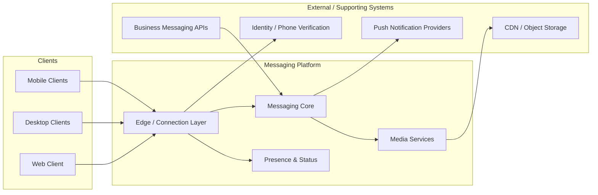

# WhatsApp Architecture Design Document

## Table of Contents

1. [Introduction](#1-introduction)
2. [Business Requirements](#2-business-requirements)
3. [Functional Requirements](#3-functional-requirements)
4. [Non-Functional Requirements](#4-non-functional-requirements)
5. [Domain Analysis (DDD)](#5-domain-analysis-ddd)
6. [High-Level Architecture](#6-high-level-architecture)
7. [Core Components / Services](#7-core-components--services)
8. [Database Design](#8-database-design)
9. [API Design](#9-api-design)
10. [Communication Patterns](#10-communication-patterns)
11. [Scalability Strategy](#11-scalability-strategy)
12. [Performance Considerations](#12-performance-considerations)
13. [Security Considerations](#13-security-considerations)
14. [Reliability & Fault Tolerance](#14-reliability--fault-tolerance)
15. [Deployment Strategy](#15-deployment-strategy)
16. [Monitoring & Observability](#16-monitoring--observability)
17. [Trade-offs & Design Decisions](#17-trade-offs--design-decisions)
18. [Future Improvements](#18-future-improvements)
19. [Conclusion](#19-conclusion)

---

# 1. Introduction

## Overview

This document describes the architecture of a large-scale, real-time messaging platform modeled after WhatsApp. The system is designed to support billions of users exchanging text messages, media, voice notes, and calls with low latency, high reliability, and end-to-end encryption as a core product guarantee.

The platform enables users to send one-to-one and group messages, share images, videos, documents, and audio, see presence and delivery status, make voice and video calls, and manage contacts and chat history across mobile and desktop clients. Behind these user-facing capabilities sits a distributed messaging backbone optimized for persistent connections, efficient fan-out, offline delivery, and privacy-preserving storage.

The architecture prioritizes connection density, message delivery guarantees, horizontal scalability, and security by design. Peak events—global holidays, major news moments, or regional outages that cause reconnect storms—are treated as first-class capacity and resilience drivers, not rare exceptions.

Although this document uses a consumer messaging product as the reference domain, the same architectural principles apply to many real-time communication systems where persistent sessions, ordered delivery, multi-device sync, and encrypted payloads must coexist at internet scale.

### System Context

The platform sits between client applications, identity and contact discovery, media storage, push notification providers, and optional enterprise/business APIs. Users connect through long-lived sessions to connection and messaging layers. Content delivery networks, object storage, and push services are supporting systems outside the core messaging ownership boundary.

| Actor / System | Type | Relationship to the Platform |
|----------------|------|------------------------------|
| Mobile Client (iOS / Android) | Primary actor | Maintains persistent sessions; sends/receives messages, media, and call signaling |
| Desktop / Web Client | Primary actor | Multi-device sync of chats; linked-device authentication flows |
| Connection / Edge Layer | Core platform | Terminates TLS, multiplexes sessions, routes frames to messaging services |
| Messaging Core | Core platform | Stores, routes, fans out, and acknowledges message delivery |
| Media Services | Core platform | Handles upload, processing, and retrieval of encrypted media blobs |
| Push Notification Providers | External system | Wakes offline clients (APNs, FCM, and regional equivalents) |
| CDN / Object Storage | Supporting system | Serves media and static assets with high availability and low latency |
| Identity / Phone Verification | Supporting system | Registers users via phone number and issues session credentials |
| Business Messaging APIs | External / partner channel | Enables verified businesses to send templated and conversational messages |

---

## Goals

The primary goals of the architecture are to:

- Support billions of registered users and hundreds of millions of concurrent online sessions
- Deliver one-to-one messages with low end-to-end latency under normal and peak load
- Provide reliable offline delivery with clear acknowledgment semantics (sent, delivered, read)
- Scale group messaging efficiently without collapsing under large fan-out
- Enforce end-to-end encryption for user content while enabling multi-device sync
- Maintain high availability of connection and messaging paths across regions
- Survive reconnect storms and partial regional failures without cascading outages
- Keep per-connection and per-message cost low enough for global consumer scale
- Isolate failures so that media, calling, or push degradation does not block text messaging
- Enable independent evolution of messaging, media, presence, and calling capabilities

---

## Architectural Approach

The platform adopts a connection-centric, service-oriented architecture optimized for real-time delivery. Long-lived client sessions terminate at a horizontally scaled connection layer. Message routing, storage, presence, media, and calling are separated into dedicated services with clear ownership boundaries. Cross-cutting concerns such as authentication, rate limiting, TLS termination, and observability are handled at the edge and platform layers rather than being re-implemented inside every service.

Key architectural principles include:

| Principle | Role in this Platform |
|-----------|------------------------|
| Domain-Driven Design (DDD) | Aligns service boundaries with messaging, media, presence, identity, and calling domains |
| Clean Architecture | Keeps delivery and encryption rules independent of transport and storage technology |
| Persistent Connection Model | Uses long-lived sessions (for example WebSocket or custom binary protocols) for low-latency push |
| Microservices / Service Orientation | Enables independent scaling of connection, chat, media, and presence workloads |
| Event-Driven Fan-out | Decouples message write paths from group delivery, push, and analytics side effects |
| CQRS (where justified) | Separates write-optimized message ingest from read/sync views for multi-device catch-up |
| Sharding by User / Chat | Partitions state so that hot users and large groups can be scaled independently |
| Security by Design | Treats E2E encryption, key management, and minimal server-side plaintext as product requirements |
| Cloud-Native / Multi-Region Deployment | Uses containers or equivalent fleets, regional capacity, and elastic connection pools |
| Observability by Design | Treats connection health, queue lag, delivery latency, and drop rates as runtime contracts |

These patterns were selected to balance latency, connection density, privacy, and operational cost. They are not applied indiscriminately: synchronous request/response remains appropriate for registration, profile updates, and media upload handshakes. Asynchronous fan-out and store-and-forward are preferred for delivery to offline or multi-device recipients where temporary inconsistency of presence or read receipts is acceptable.

---

## Intended Audience

This document is intended for:

- Software Engineers
- Senior Developers
- Technical Leads
- Solution Architects
- Engineering Managers
- Students learning large-scale distributed systems and real-time architecture

Readers are expected to use this document as a design reference for implementation planning, design reviews, and onboarding—not as a product tutorial or reverse-engineering guide of any specific vendor implementation.

---

## Scope

The architecture covers the following business domains:

| Domain | Responsibility Summary |
|--------|------------------------|
| Identity & Registration | Phone-based signup, session credentials, device linking, and account lifecycle |
| Connection Management | Persistent sessions, heartbeat, reconnect, and connection affinity |
| One-to-One Messaging | Message send, store-and-forward, acknowledgments, and ordering |
| Group Messaging | Group membership, fan-out, admin controls, and large-group delivery strategies |
| Multi-Device Sync | Linked devices, catch-up queues, and consistent chat views across clients |
| Presence & Status | Online/last-seen signals, typing indicators, and ephemeral status updates |
| Media | Encrypted media upload, processing, storage references, and download |
| Push Notifications | Offline wake-up via platform push providers with privacy-conscious payloads |
| Voice & Video Calling | Signaling, session setup, and media path coordination (not full WebRTC stack detail) |
| Contacts & Discovery | Address book sync, user lookup, and blocking/privacy controls |
| Business Messaging | Partner/business API ingress with rate limits and template policies |
| Administration & Abuse | Reporting, spam controls, rate limiting, and operational tooling |

External integrations such as push providers, CDNs, object storage, and phone verification services are considered supporting systems. The platform defines integration contracts and ownership boundaries for these systems but does not own their internal implementations.

---

## Out of Scope

The following topics are intentionally excluded from this document:

- Front-end UI/UX implementation details for mobile and desktop clients
- Native OS-level push provider configuration runbooks
- Full WebRTC media-plane engineering (codecs, congestion control, TURN farm ops)
- Vendor-specific cloud control-plane configuration
- Infrastructure provisioning scripts and CI/CD pipeline implementation details
- Content moderation ML model training and policy operations
- WhatsApp Business Platform commercial packaging and pricing

These areas may be documented separately where appropriate. Later sections reference integration needs and operational constraints without prescribing client frameworks or a specific cloud vendor’s control-plane configuration.

---

## Document Conventions

- Requirements and decisions are written for a production-scale messaging system, including trade-offs and alternatives.
- Mermaid diagrams are used inline where they improve clarity; optional assets may be added under `assets/` later.
- Section 18 is titled **Future Improvements** to reflect planned evolution beyond the baseline architecture described here.
- References to “WhatsApp” describe a reference architecture inspired by public-scale messaging systems; they are not a claim of internal Meta implementation detail.

---

<!-- Sections 2–19 will be added after review of Section 1. -->
