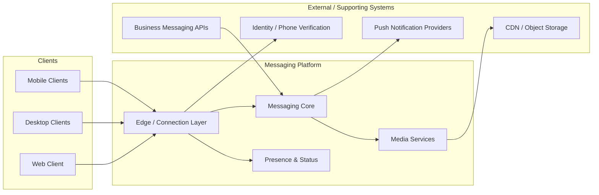
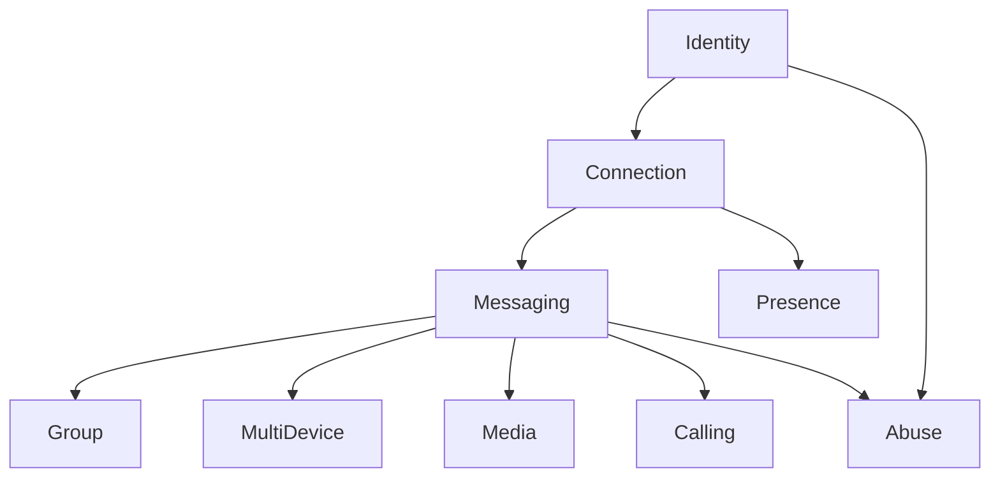
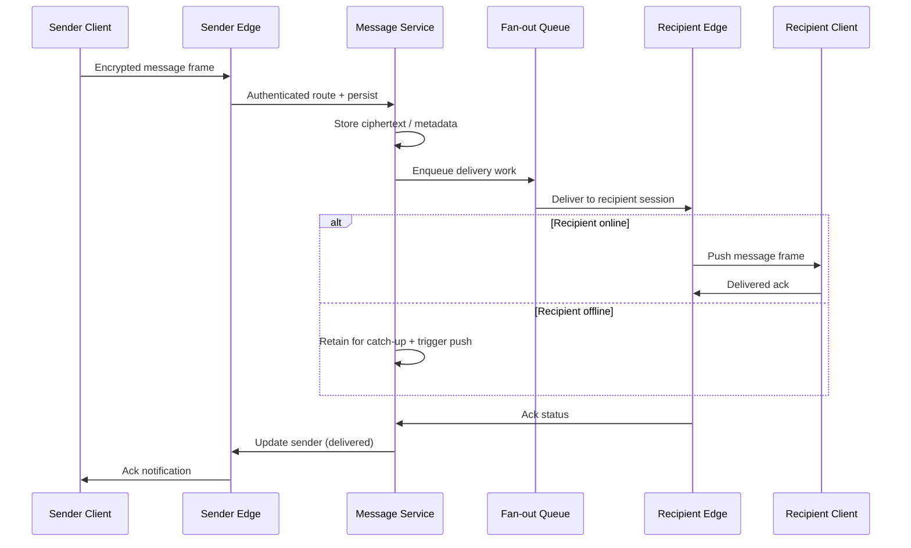

# WhatsApp Architecture Design Document

## Table of Contents

1. [Introduction](#1-introduction)
2. [Business Requirements](#2-business-requirements)
3. [Functional Requirements](#3-functional-requirements)
4. [Non-Functional Requirements](#4-non-functional-requirements)
5. [Domain Analysis (DDD)](#5-domain-analysis-ddd)
6. [High-Level Architecture](#6-high-level-architecture)
7. [Core Components / Services](#7-core-components--services)
8. [Database Design](#8-database-design)
9. [API Design](#9-api-design)
10. [Communication Patterns](#10-communication-patterns)
11. [Scalability Strategy](#11-scalability-strategy)
12. [Performance Considerations](#12-performance-considerations)
13. [Security Considerations](#13-security-considerations)
14. [Reliability & Fault Tolerance](#14-reliability--fault-tolerance)
15. [Deployment Strategy](#15-deployment-strategy)
16. [Monitoring & Observability](#16-monitoring--observability)
17. [Trade-offs & Design Decisions](#17-trade-offs--design-decisions)
18. [Future Improvements](#18-future-improvements)
19. [Conclusion](#19-conclusion)

---

# 1. Introduction

## Overview

This document describes the architecture of a large-scale, real-time messaging platform modeled after WhatsApp. The system supports billions of users exchanging text messages, media, voice notes, and calls with low latency, high reliability, and end-to-end encryption (E2EE) as a core guarantee.

Users send one-to-one and group messages, share images, videos, documents, and audio, view presence and delivery status, make voice and video calls, and manage contacts and chat history across mobile and desktop clients. The distributed messaging backbone optimizes persistent connections, efficient fan-out, offline delivery, and privacy-preserving storage.

The architecture prioritizes connection density, message delivery guarantees, horizontal scalability, and security by design. It handles peak events—holidays, major news moments, and reconnect storms—as first-class capacity and resilience concerns.

Although this document uses a consumer messaging product as the reference domain, the same architectural principles apply to many real-time communication systems where persistent sessions, ordered delivery, multi-device sync, and encrypted payloads must coexist at internet scale.

### System Context

The platform sits between client applications, identity and contact discovery, media storage, push notification providers, and business APIs. Clients maintain long-lived sessions with connection and messaging layers. Supporting systems include CDNs, object storage, and push services.



| Actor / System | Type | Relationship to the Platform |
|----------------|------|------------------------------|
| Mobile Client (iOS / Android) | Primary actor | Maintains persistent sessions; sends/receives messages, media, and call signaling |
| Desktop / Web Client | Primary actor | Multi-device sync of chats; linked-device authentication flows |
| Connection / Edge Layer | Core platform | Terminates TLS, multiplexes sessions, routes frames to messaging services |
| Messaging Core | Core platform | Stores, routes, fans out, and acknowledges message delivery |
| Media Services | Core platform | Handles upload, processing, and retrieval of encrypted media blobs |
| Push Notification Providers | External system | Wakes offline clients (APNs, FCM, and regional equivalents) |
| CDN / Object Storage | Supporting system | Serves media and static assets with high availability and low latency |
| Identity / Phone Verification | Supporting system | Registers users via phone number and issues session credentials |
| Business Messaging APIs | External / partner channel | Enables verified businesses to send templated and conversational messages |

---

## Goals

The primary goals of the architecture are to:

- Support billions of users and hundreds of millions of concurrent sessions
- Deliver one-to-one and group messages with low latency and reliable offline delivery
- Provide clear acknowledgment semantics (sent, delivered, read)
- Scale group fan-out and multi-device sync efficiently
- Enforce E2EE while enabling multi-device support
- Maintain high availability across regions with resilience to failures and reconnect storms
- Keep per-connection and per-message cost low enough for global consumer scale
- Isolate failures so that media or calling degradation does not block text messaging
- Enable independent evolution of messaging, media, presence, and calling capabilities

---

## Architectural Approach

The platform uses a connection-centric, service-oriented architecture. Long-lived sessions (for example WebSocket or custom binary / XMPP-like protocols) terminate at a horizontally scaled edge layer. Routing, storage, presence, media, and calling are dedicated services with clear ownership boundaries.

| Principle | Role in this Platform |
|-----------|------------------------|
| Domain-Driven Design (DDD) | Aligns service boundaries with messaging, media, presence, identity, and calling domains |
| Clean Architecture | Keeps delivery and encryption rules independent of transport and storage technology |
| Persistent Connection Model | Uses long-lived sessions for low-latency push to online clients |
| Microservices / Service Orientation | Enables independent scaling of connection, chat, media, and presence workloads |
| Event-Driven Fan-out | Decouples message write paths from group delivery, push, and analytics side effects |
| CQRS (where justified) | Separates write-optimized message ingest from read/sync views for multi-device catch-up |
| Sharding by User / Chat | Partitions state so hot users and large groups can scale independently |
| Security by Design | Treats E2EE, key management, and minimal server-side plaintext as product requirements |
| Cloud-Native / Multi-Region Deployment | Uses containers or equivalent fleets, regional capacity, and elastic connection pools |
| Observability by Design | Treats connection health, queue lag, delivery latency, and drop rates as runtime contracts |

Synchronous request/response remains appropriate for registration, profile updates, and media upload handshakes. Asynchronous fan-out and store-and-forward are preferred for delivery to offline or multi-device recipients where temporary inconsistency of presence or read receipts is acceptable.

---

## Intended Audience

This document is intended for:

- Software Engineers
- Senior Developers
- Technical Leads
- Solution Architects
- Engineering Managers
- Students learning large-scale distributed systems and real-time architecture

Readers should treat this as a design reference for planning, reviews, and onboarding—not as a product tutorial or reverse-engineering of any specific vendor implementation.

---

## Scope

| Domain | Responsibility Summary |
|--------|------------------------|
| Identity & Registration | Phone-based signup, session credentials, device linking, account lifecycle |
| Connection Management | Persistent sessions, heartbeats, reconnect, connection affinity |
| One-to-One Messaging | Send, store-and-forward, acknowledgments, ordering |
| Group Messaging | Membership, fan-out, admin controls, large-group delivery |
| Multi-Device Sync | Linked devices, catch-up queues, consistent chat views |
| Presence & Status | Online/last-seen, typing indicators, ephemeral status |
| Media | Encrypted upload, processing, storage references, download |
| Push Notifications | Offline wake-up via platform push providers |
| Voice & Video Calling | Signaling and media-path coordination (not full WebRTC stack detail) |
| Contacts & Discovery | Address book sync, user lookup, blocking/privacy controls |
| Business Messaging | Partner/business API ingress with rate limits and templates |
| Administration & Abuse | Reporting, spam controls, rate limiting, operational tooling |

---

## Out of Scope

- Client UI/UX implementation details
- Full WebRTC media-plane engineering (codecs, congestion control, TURN farm ops)
- Vendor-specific infrastructure scripts and cloud control-plane runbooks
- Content moderation ML model training and policy operations
- WhatsApp Business Platform commercial packaging and pricing

---

# 2. Business Requirements

| Requirement | Description | Business Driver |
|-------------|-------------|-----------------|
| Global real-time communication | Seamless messaging for consumer and business users worldwide | Core product value; network effects |
| Privacy by default | E2EE and minimal server-side retention of message content | Trust, regulatory expectations, competitive differentiation |
| Business monetization | Business APIs and templates without degrading consumer UX | Sustainable revenue adjacent to free consumer messaging |
| Retention through reliability | Low data usage, cross-device support, consistent delivery | Reduce churn in markets with constrained networks |
| Cost-effective hypergrowth | Support explosive volume (for example 100B+ messages/day) | Unit economics at internet scale |

### Business Constraints

- Consumer messaging remains free and must not be held back by business features
- Server-side systems must not require access to plaintext message content
- Growth must be absorbable through horizontal scale rather than vertical “hero” servers alone
- Regional availability and reconnect behavior are product-visible, not only infrastructure metrics

---

# 3. Functional Requirements

| Capability | Requirement |
|------------|-------------|
| Conversations | One-to-one and group conversations |
| Acknowledgments | Sent, delivered, and read receipts |
| Media sharing | Images, videos, audio, and documents with upload/download |
| Offline delivery | Persistent storage and delivery when recipients reconnect |
| Push | Notifications for offline users via APNs/FCM (or equivalents) |
| Presence | Online/last-seen and typing indicators |
| Calling | Voice/video call signaling |
| Multi-device | Sync across linked devices and contact management |
| Groups | Admin controls (add/remove, roles, settings) |
| Business messaging | Templated and conversational business messages |

### Primary User Flows

1. **Online send** — Sender writes ciphertext → edge → message service stores and routes → recipient edge pushes → acks flow back (sent → delivered → read).
2. **Offline send** — Message is durably queued; push wakes the device; catch-up on reconnect delivers pending ciphertext.
3. **Group send** — Membership resolved → fan-out to members (online push / offline store) using group encryption primitives (for example Sender Keys).
4. **Media share** — Client uploads encrypted blob → media service returns media ID → message references media ID → recipients download ciphertext.

---

# 4. Non-Functional Requirements

| Category | Target |
|----------|--------|
| Latency | Sub-second one-to-one delivery under normal load |
| Consistency | Ordered delivery for messages; eventual consistency acceptable for presence/read receipts |
| Availability | High (for example 99.99%), with tolerance for temporary presence inconsistency |
| Security | Mandatory E2EE; servers operate on ciphertext for user content |
| Scalability | 2B+ users, 100B+ messages/day, millions of concurrent connections |
| Reliability | Durable storage, offline queuing, fault isolation across domains |
| Performance | Low bandwidth via efficient protocols/compression; usable on poor networks |

### Capacity Estimates (Illustrative)

| Metric | Example Order of Magnitude |
|--------|----------------------------|
| Message storage growth | ~10 TB/day (policy-dependent retention) |
| Aggregate messaging bandwidth | ~926 Mb/s (highly dependent on media mix) |
| Chat / connection servers | Hundreds to thousands, depending on connection density |
| Connections per server | Millions feasible with efficient runtimes (for example Erlang-style soft real-time) |

These figures are planning anchors, not SLOs. Actual sizing depends on retention policy, media ratio, average message size, and regional traffic mix.

---

# 5. Domain Analysis (DDD)

## Bounded Contexts

| Bounded Context | Responsibility |
|-----------------|----------------|
| Identity | User registration, phone verification, device linking |
| Connection | Session management, heartbeats, reconnects |
| Messaging | One-to-one/group send, store-and-forward, acks |
| Presence | Online status, typing, last-seen |
| Media | Encrypted blob upload, processing, retrieval |
| Group | Membership, admin, fan-out strategy |
| Multi-Device | Sync, catch-up queues |
| Calling | Signaling and relay coordination |
| Abuse / Compliance | Reporting, spam, rate limiting |

## Aggregates and Ubiquitous Language

| Aggregate | Key Concepts |
|-----------|--------------|
| User | Account, devices, identity keys, privacy settings |
| Chat / Conversation | Participants, chat ID, mute/archive state |
| Message | Message ID, ciphertext, type, timestamps, ack state |
| Group | Membership, admins, sender-key epoch, settings |
| Media Asset | Media ID, encrypted blob reference, size/type metadata |

Services map to these domains so that changes in presence or media do not require coordinated deployments with core message routing, and so that ubiquitous language stays consistent across teams.



---

# 6. High-Level Architecture

Clients connect via persistent sessions (WebSocket or custom protocol) to edge/gateway servers. Messages route through messaging services, with fan-out via queues (for example Kafka). Offline messages are stored and delivered on reconnect. Media uses object storage plus CDN. Presence and session maps use caching (Redis). E2EE is implemented with the Signal Protocol family.

### Typical Message Flow

**Sender → Edge → Message Service (store + queue) → Recipient Edge (push or store) → Ack back to sender**



| Layer | Responsibility |
|-------|----------------|
| Clients | E2EE, UI, local store, reconnect/catch-up |
| Edge / Gateway | TLS, auth, session affinity, frame routing |
| Messaging Core | Persist, route, ack state, offline queues |
| Fan-out / Events | Group delivery, push triggers, side effects |
| Data & Cache | Message stores, session maps, presence |
| Media Plane | Encrypted blob storage and CDN delivery |

---

# 7. Core Components & Services

| Service | Responsibility |
|---------|----------------|
| Connection / Edge Layer | WebSocket or XMPP-like gateways; terminate connections; auth/TLS; heartbeat |
| Message Service | Routing, storage, delivery, acknowledgment state |
| Presence Service | Online/last-seen/typing status tracking |
| Media / Asset Service | Upload, optional dedup of ciphertext blobs, CDN serving |
| Group Service | Membership, admin rules, fan-out coordination |
| Push Service | Integration with APNs/FCM and regional providers |
| Auth / Identity Service | Registration, verification, session credentials, device linking |
| Multi-Device Sync Service | Catch-up queues and linked-device delivery |

### Design Notes

- **Connection layer** optimizes for connection density and cheap heartbeats; it should remain thin and avoid heavy business logic.
- **Message service** owns delivery guarantees and ack transitions; it must remain available even if media or calling is degraded.
- **Group service** owns membership consistency; fan-out workers consume membership snapshots or incremental membership events.
- **Push service** sends privacy-conscious payloads (often opaque) sufficient to wake the client for catch-up.

---

# 8. Database Design

| Data Class | Storage Choice | Rationale |
|------------|----------------|-----------|
| Users / metadata | PostgreSQL or MySQL (sharded) | Structured profiles, groups metadata, transactional updates |
| Messages | Cassandra, DynamoDB, or Mnesia-like wide-column / time-series | High write throughput; sharded by user or chat |
| Sessions / presence | Redis | Fast user → server mapping and online status |
| Media blobs | Object storage (S3-like) | Cheap, durable large-object storage |
| Media metadata | Relational or document store | Lookup by media ID, ownership, expiry |
| Groups | SQL + cache | Membership and admin state with hot-path caching |

### Sharding and Retention

- Shard by **user ID** or **conversation ID** to localize hot partitions and support independent scale-out.
- Apply retention policies: delete after successful delivery where product policy allows, or retain for a bounded period (for example 30 days) for multi-device catch-up—never longer than privacy and product requirements demand.
- Store **ciphertext + routing metadata** only for user content; avoid schemas that imply server-side plaintext bodies.

```text
MessageRecord (logical)
-----------------------
message_id
chat_id
sender_id
ciphertext
media_ref?          # optional
created_at
ack_state           # per recipient / device as needed
expiry_at
```

---

# 9. API Design

APIs split into control-plane REST (or similar) for uploads and catch-up, and a real-time session protocol for messaging frames.

### REST Examples

| Method & Path | Purpose |
|---------------|---------|
| `POST /messages` | Send message (`sender_id`, `receiver_id`, `type`, content or `media_id`) |
| `GET /messages?user_id=...` | Fetch unread / offline messages for catch-up |
| `POST /v1/media` | Upload media → return `media_id` |
| `GET /v1/media/download?file_id=...` | Download encrypted media blob |

### WebSocket / Real-Time Frames

| Frame Type | Purpose |
|------------|---------|
| `message.send` | Transmit encrypted chat message |
| `message.ack` | Sent / delivered / read acknowledgments |
| `presence.update` | Online / last-seen updates |
| `typing` | Typing indicators (often batched/throttled) |
| `call.signal` | Voice/video signaling messages |

Contracts should version carefully: clients on slow upgrade cycles must remain compatible with older frame schemas while new encryption or multi-device features roll out.

---

# 10. Communication Patterns

| Pattern | Where Used |
|---------|------------|
| Persistent bidirectional sessions | Online messaging, presence, typing, call signaling |
| Store-and-forward | Offline recipients and multi-device catch-up |
| Event-driven fan-out (Kafka or equivalent) | Group delivery, push triggers, analytics |
| Pub/Sub (Redis or equivalent) | Presence and cross-server session routing hints |
| Asynchronous processing | Media processing and large-group fan-out |

### Sync vs Async Guidance

- **Synchronous (session path):** auth handshake, online message push to a connected recipient, ack updates on the hot path.
- **Asynchronous:** group fan-out expansion, offline push, media post-processing, abuse scoring.

Prefer async when work can complete after the sender receives “sent,” and when temporary lag on read receipts or presence is acceptable.

---

# 11. Scalability Strategy

| Strategy | Application |
|----------|-------------|
| Horizontal connection scale | Add edge servers; target millions of connections per server with efficient runtimes |
| Sharding / partitioning | Partition users and chats; isolate hot groups |
| Message queues | Decouple ingest from fan-out and push |
| Multi-region + geo-routing | Place edges near users; keep regional failure domains |
| Caching + CDN | Session maps, presence, media downloads |

### Scaling Dimensions

1. **Connections** — Scale edge fleets independently of storage.
2. **Write path** — Scale message ingest and durable stores by shard.
3. **Fan-out** — Scale group workers separately; consider membership-size tiers (small sync fan-out vs large async fan-out).
4. **Media** — Scale object storage and CDN independently of chat servers.

---

# 12. Performance Considerations

- Use efficient protocols, compression, and binary framing to reduce bandwidth on constrained mobile networks.
- Geo-distribute edge PoPs so most users have a nearby connection terminator.
- Batch and throttle high-churn signals (especially typing indicators).
- Optimize database writes for append-heavy message workloads; preserve FIFO ordering per conversation where required.
- Keep edge handlers allocation-light; push heavy work to async workers.
- Prefer incremental catch-up (since watermark) over full history sync on reconnect.

---

# 13. Security Considerations

| Control | Implementation Focus |
|---------|----------------------|
| E2EE | Signal Protocol (X3DH, Double Ratchet; Sender Keys for groups); servers never see plaintext content |
| Transport security | TLS for all client and inter-service links on the public path |
| Identity | Phone-based registration with verification; device linking with explicit user consent |
| Abuse controls | Rate limiting, spam detection, reporting workflows |
| Data minimization | Minimal retention of ciphertext and metadata; clear expiry policies |

### Security Design Notes

- Key material for content encryption lives on client devices; server stores only what is required for routing, spam defense, and multi-device ciphertext delivery.
- Push payloads should avoid leaking message bodies; prefer opaque wake-ups plus encrypted catch-up over the secure channel.
- Business APIs need stricter rate limits, template controls, and abuse isolation so they cannot degrade consumer messaging capacity.

---

# 14. Reliability & Fault Tolerance

| Mechanism | Purpose |
|-----------|---------|
| Store-and-forward + durable queues | Survive recipient offline periods and transient edge loss |
| Replication | Survive node and zone failures for message and metadata stores |
| Reconnect + catch-up | Restore sessions and drain pending ciphertext after network flaps |
| Circuit breakers / isolation | Media or calling failures must not block text messaging |
| Resilient runtime practices | “Let it crash” supervision in runtimes suited to soft real-time messaging |

### Failure Modes Explicitly Designed For

- Regional edge outage → geo-reroute new sessions; drain or fail over sticky maps carefully
- Queue lag spike → backpressure, shed non-critical presence traffic first
- Reconnect storm → admission control, staggered reconnect, prioritized auth/catch-up capacity
- Hot group → isolate fan-out workers and protect shared message ingest

---

# 15. Deployment Strategy

| Aspect | Approach |
|--------|----------|
| Runtime packaging | Cloud-native containers / orchestration where appropriate; specialized OS/runtime for connection-dense cores |
| Topology | Multi-region; edge PoPs for connections and media/call relays |
| Releases | Blue-green or canary for edge and messaging services |
| Core servers | Erlang/FreeBSD-style (or equivalent) fleets historically favored for connection density and soft real-time |

Deploy connection and messaging planes with independent release trains so a media or calling change cannot force a global messaging outage window.

---

# 16. Monitoring & Observability

| Signal | Why It Matters |
|--------|----------------|
| Connection health / churn | Detect reconnect storms and bad client builds |
| Queue lag | Early warning for fan-out or offline delivery backlog |
| Delivery latency | User-visible messaging SLO |
| Drop / error rates | Protocol bugs, auth failures, shard hotspots |
| Regional saturation | Capacity planning and failover decisions |

### Observability Stack Expectations

- Metrics, structured logs, and distributed tracing across edge → message service → queue → recipient edge
- Dashboards analogous to Prometheus/Grafana for SLOs and capacity
- Alerting on reconnect storms, regional error budget burn, and sustained queue lag

Trace IDs should survive ack paths so “sent but never delivered” investigations can correlate sender and recipient hops without inspecting ciphertext bodies.

---

# 17. Trade-offs & Design Decisions

| Decision | Choice | Trade-off |
|----------|--------|-----------|
| Consistency vs availability | Favor availability; eventual consistency for presence/read receipts | Simpler global operation; receipts may lag briefly |
| Stateful connections | Required for low-latency push | Needs careful session maps, sticky routing, and reconnect design |
| SQL vs NoSQL | Relational for metadata; wide-column for messages | Operational complexity of two storage models; better fit per workload |
| Custom vs off-the-shelf | Optimized protocols/runtimes for extreme scale | Higher expertise cost vs. faster commodity stacks |
| E2EE | Non-negotiable for user content | Adds multi-device and group-key complexity; limits server-side features |

### Alternatives Considered

- **Pure request/response polling** — Simpler ops, unacceptable latency and battery/network cost at this scale.
- **Single shared SQL store for all messages** — Stronger ad-hoc queryability, poor write scalability and hotspot behavior.
- **Server-side searchable plaintext** — Enables features, incompatible with E2EE product requirements.

---

# 18. Future Improvements

- Enhanced multi-device support (more linked devices, richer sync semantics)
- Privacy-preserving AI features (smart replies, summarization) that do not require server plaintext
- Further protocol optimizations for emerging networks and constrained devices
- Deeper integration with business platforms while protecting consumer capacity
- Improved calling relay scalability and potential AR/VR communication extensions

Each improvement should be evaluated against E2EE constraints, connection-plane capacity, and failure isolation before adoption.

---

# 19. Conclusion

This architecture delivers a reliable, private, and scalable messaging platform for internet-scale demand by combining persistent connections, decoupled services, efficient storage, and strong security primitives. It balances user experience with operational feasibility and serves as a practical reference for similar real-time systems—favoring availability, ciphertext-first design, and independent scale of connection, messaging, media, and calling planes.
