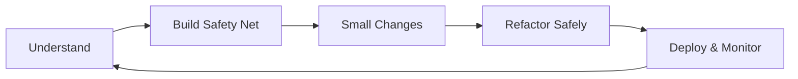
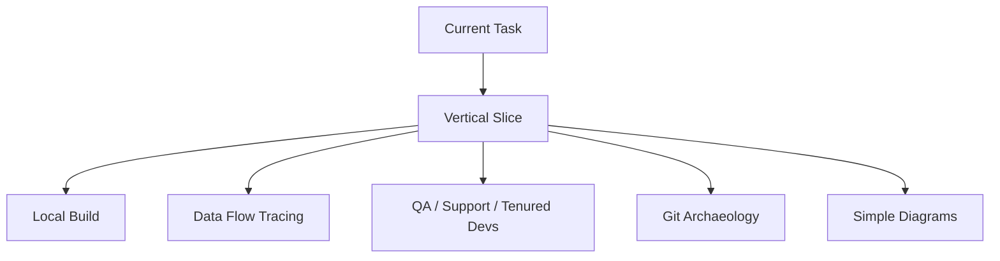
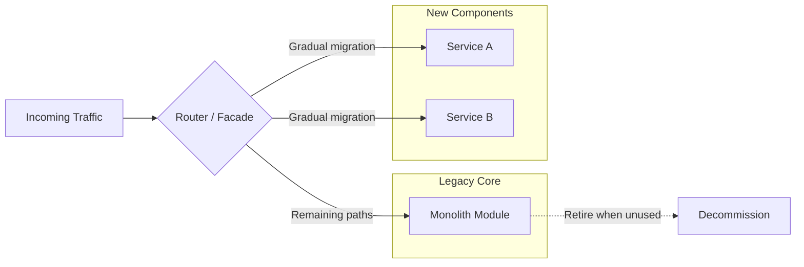

# Modernizing Legacy Systems One Safe Change at a Time

> **A practical playbook for incrementally improving production systems without risky big-bang rewrites.**

---

## Table of Contents

1. [Introduction](#1-introduction)
2. [Why Most Legacy Rewrites Fail](#2-why-most-legacy-rewrites-fail)
3. [The Legacy Refactoring Mindset](#3-the-legacy-refactoring-mindset)
4. [Phase 1 – Understand Before Changing](#4-phase-1--understand-before-changing)
5. [Phase 2 – Build a Safety Net](#5-phase-2--build-a-safety-net)
6. [Phase 3 – Make Small Changes](#6-phase-3--make-small-changes)
7. [Phase 4 – Refactor Safely](#7-phase-4--refactor-safely)
8. [Common Refactoring Patterns](#8-common-refactoring-patterns)
9. [AI-Assisted Refactoring](#9-ai-assisted-refactoring)
10. [Production Deployment Strategy](#10-production-deployment-strategy)
11. [Common Mistakes to Avoid](#11-common-mistakes-to-avoid)
12. [Real-World Lessons](#12-real-world-lessons)
13. [Practical Checklist](#13-practical-checklist)
14. [Recommended Books & References](#14-recommended-books--references)
15. [Conclusion](#15-conclusion)

---

# 1. Introduction

Legacy code is not "bad code." It is code that already exists, runs in production, and carries years of hard-won business knowledge—edge cases, regulatory workarounds, and performance tweaks that no one remembers writing.

Michael Feathers' famous definition still holds: **legacy code is code without tests.** Even when tests exist, they are often outdated, incomplete, or irrelevant to current requirements.

The goal is never a risky big-bang rewrite. The goal is to treat the system as a living organism and improve it incrementally while protecting it from regressions.

| Approach | Risk Profile | Typical Outcome |
|----------|--------------|-----------------|
| Big-bang rewrite | High | Delayed delivery, lost implicit knowledge, parallel maintenance burden |
| Incremental modernization | Low to medium | Continuous value delivery, preserved behavior, compounding improvements |

---

# 2. Why Most Legacy Rewrites Fail

Full rewrites look attractive on paper. In practice they usually fail for three reasons:

1. **Implicit knowledge is never fully captured.** The original system encodes behavior that never made it into requirements documents.
2. **Delivery pressure forces compromise.** Teams re-implement the same messy workarounds under deadline pressure.
3. **The business cannot wait.** Months or years of parallel development are required before the new system matches every obscure behavior.

Netscape's multi-year browser rewrite is the classic cautionary tale. The safer path is continuous, low-risk improvement.

---

# 3. The Legacy Refactoring Mindset

Adopt three principles:

| Principle | What It Means |
|-----------|---------------|
| **Detect breakage** | Never change functional code without a way to detect regressions |
| **Small, reversible steps** | Prefer incremental changes over large redesigns |
| **Separate concerns** | Never mix pure refactoring with feature work in the same pull request |

---

# 4. Phase 1 – Understand Before Changing

Before touching a single line:

- Get a reliable local build and document the setup in the README.
- Trace data flow with your IDE's "find references" and call hierarchy tools.
- Run static analysis and linters to surface complexity, dead code, and security issues.
- Use the software yourself. Talk to QA, support, and long-tenured developers. Read git history like an archaeologist.
- Draw simple diagrams of the parts you will touch. These become living documentation.

Resist the urge to understand the entire million-line system at once. **Focus on the vertical slice required by the current task**, then expand outward.

---

# 5. Phase 2 – Build a Safety Net

This is non-negotiable.

**Characterization tests** are your primary tool when unit tests are missing or untrustworthy. Write tests that capture current behavior—including bugs—before you change anything. These tests become the contract you must preserve.

When the code is too tangled for traditional unit tests:

| Technique | When to Use |
|-----------|-------------|
| Golden-master / replay testing | Capture real inputs and outputs and replay them |
| Seams (Feathers) | Insert test doubles or intercept calls without rewriting core logic |
| Integration / E2E tests | Prefer broader tests over fragile unit tests coupled to internal structure |

If existing unit tests are outdated:

1. Run the suite and record failures as a baseline.
2. Update or delete tests that no longer match intended behavior—only after confirming with stakeholders.
3. Add characterization tests around the areas you plan to change so old tests do not give false confidence.
4. Treat the test suite itself as code that needs gradual improvement—never leave it broken.

Continuous integration that runs the growing test suite on every change is the real safety net.

---

# 6. Phase 3 – Make Small Changes

When you must add a feature or fix a bug:

| Pattern | Description |
|---------|-------------|
| **Sprout** | Write new behavior in a clean class or method and call it from legacy code. Leave the old code untouched. |
| **Wrap** | Surround an existing method with a decorator or adapter that adds pre-/post-processing. |
| **Boy Scout Rule** | Leave every file a little cleaner than you found it—rename a variable, extract a method, delete confirmed dead code. |

Keep the change set small enough that a reviewer can understand the diff in minutes.

---

# 7. Phase 4 – Refactor Safely

Refactoring means improving internal structure **without changing external behavior**.

Rules of engagement:

- Only refactor code that is covered by characterization or unit tests.
- Start from the deepest, most stable points and work outward.
- Run the test suite after every tiny step.
- Use version control tags or branches so you can revert instantly.
- Never refactor and add features in the same commit.

For larger architectural moves, apply the **Strangler Fig pattern**: gradually route traffic or functionality to new components until the old core can be retired.

---

# 8. Common Refactoring Patterns

Apply these only where tests give you confidence:

- Extract Method / Extract Class
- Introduce Parameter Object
- Replace Conditional with Polymorphism
- Move Method / Move Field
- Replace Magic Numbers and Hard-coded Strings
- Break God Classes and Long Methods

---

# 9. AI-Assisted Refactoring

Modern AI tools (IDE plugins, OpenRewrite, large language models) can accelerate understanding and mechanical transformations:

- Explain opaque blocks of code.
- Suggest renames and extractions.
- Translate obsolete syntax or help migrate between language versions.

**Treat AI output as a first draft.** Always verify with tests and human review. AI does not understand the undocumented business rules that keep the system running.

---

# 10. Production Deployment Strategy

| Practice | Rationale |
|----------|-----------|
| Feature flags / dark launches | Enable new paths gradually without all-or-nothing risk |
| Deploy the same binary that passed CI | Avoid last-minute production-only changes |
| Monitor error rates, latency, and business metrics | Catch regressions early after each release |
| Maintain a fast rollback path | Limit blast radius when something goes wrong |

---

# 11. Common Mistakes to Avoid

| Mistake | Why It Hurts |
|---------|--------------|
| Starting a rewrite "because the code is ugly" | Discards working knowledge; high delivery risk |
| Mixing refactoring with feature work | Makes regressions hard to diagnose and revert |
| Changing code without characterization tests | No contract to preserve behavior |
| Trying to understand the entire system first | Analysis paralysis; no value delivered |
| Ignoring QA, support, and tenured engineers | Loses institutional knowledge |
| Letting the test suite rot | False confidence or no safety net at all |

---

# 12. Real-World Lessons

Teams that succeed treat legacy code as an **asset that already works**, not a liability to be erased. They invest in understanding, build safety nets, and improve the system in the course of normal work.

The developers who become most productive in large codebases are those who:

- Learn just enough for the current task
- Leave the code better than they found it
- Continuously expand their mental model

---

# 13. Practical Checklist

Before merging any legacy change, confirm:

- [ ] Can I build and run the system locally?
- [ ] Do I have characterization tests for the area I will touch?
- [ ] Have I separated pure refactoring from functional changes?
- [ ] Is the change small enough to review easily?
- [ ] Will CI catch regressions?
- [ ] Do I know how to roll back?
- [ ] Have I left the code slightly cleaner?

---

# 14. Recommended Books & References

| Resource | Author / Source | Focus |
|----------|-----------------|-------|
| *Working Effectively with Legacy Code* | Michael C. Feathers | Seams, characterization tests, safe change techniques |
| *Refactoring: Improving the Design of Existing Code* | Martin Fowler | Catalog of refactoring moves |
| *Refactoring to Patterns* | Joshua Kerievsky | Pattern-directed refactoring |
| Strangler Fig pattern articles and talks | Martin Fowler | Incremental architectural replacement |
| Static analysis and characterization-testing practices | Industry sources | Tooling and CI integration |

---

# 15. Conclusion

Legacy systems power most of the software that actually runs the world. The professional skill is not rewriting them from scratch—it is **modernizing them one safe, reversible, well-tested change at a time**.
