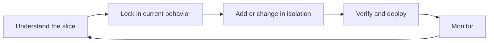
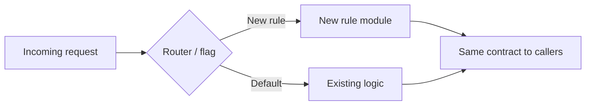

# Modernizing Legacy Systems One Safe Change at a Time

> **A practical playbook for evolving production systems that already work—adding features, updating business rules, and shipping new requirements without breaking what users depend on today.**

---

## Table of Contents

1. [Introduction](#1-introduction)
2. [The Real Problem Is Not "Dead Code"](#2-the-real-problem-is-not-dead-code)
3. [The Safe-Change Mindset](#3-the-safe-change-mindset)
4. [Understand the Slice You Are Changing](#4-understand-the-slice-you-are-changing)
5. [Build a Safety Net Around Live Behavior](#5-build-a-safety-net-around-live-behavior)
6. [Patterns for Smooth Feature and Rule Changes](#6-patterns-for-smooth-feature-and-rule-changes)
7. [Keep Refactoring Separate from Functional Work](#7-keep-refactoring-separate-from-functional-work)
8. [Ship Safely to Production](#8-ship-safely-to-production)
9. [Common Mistakes](#9-common-mistakes)
10. [Practical Checklist](#10-practical-checklist)
11. [Conclusion](#11-conclusion)

---

# 1. Introduction

Many teams do not face a system that "will not run." They face something harder: **a system that runs fine in production, earns revenue, and changes every week.**

New discount rules. Updated compliance checks. A third payment provider. A reporting field that finance needs by Friday. The code is not broken—it is **busy**. Every change carries risk because existing users, integrations, and batch jobs depend on behavior that was never written down as clearly as it should have been.

Michael Feathers' definition still applies: **legacy code is code without tests.** In a live system, that usually means behavior is preserved only in production traffic and in the heads of a few engineers.

The goal is not a big-bang rewrite. The goal is to **evolve the system in small, reversible steps** so business logic can change often without heavy rewrites or surprise regressions.

| Approach | When it fits | Risk |
|----------|--------------|------|
| Large redesign per request | Rarely | High—easy to break unrelated flows |
| Small, tested, isolated changes | Frequent business change | Low to medium—compounds over time |

---

# 2. The Real Problem Is Not "Dead Code"

Guides often assume the first step is getting an old repository to compile. That is a different problem.

For a **running production system**, the constraints look like this:

| Constraint | What it means in practice |
|------------|---------------------------|
| Zero downtime expectations | You cannot "stop the world" to refactor |
| Implicit business rules | Edge cases live in `if` blocks, not in specs |
| Frequent requirement churn | Rules change faster than architecture docs |
| Fear of regression | One wrong branch can break checkout, payroll, or billing |

Full rewrites still fail for the same reasons they always have: implicit knowledge is never fully captured, delivery pressure reintroduces old workarounds, and the business cannot wait months for parity. **The professional path is continuous, low-risk improvement while the system keeps serving users.**

Treat the codebase as an **asset that already works**, not a liability waiting to be replaced.

---

# 3. The Safe-Change Mindset

Adopt three principles before every change:

| Principle | What it means |
|-----------|---------------|
| **Detect breakage** | Never change behavior without a way to know you broke something |
| **Small, reversible steps** | Prefer one rule, one endpoint, one workflow at a time |
| **Separate concerns** | Do not mix "make it cleaner" with "make it do something new" in the same pull request |

When product asks for a logic change, your job is not only to implement it—it is to **implement it without altering every other path that touches the same module.**

---

# 4. Understand the Slice You Are Changing

You do not need to map the entire system before every ticket. You need a **vertical slice**: the entry point, the data it reads, the rules it applies, and the outputs downstream systems consume.

Before changing code:

- Trace the flow with your IDE (find references, call hierarchy).
- Read recent git history for the files you will touch—who changed what and why.
- Talk to QA, support, or a tenured developer when the rule is fuzzy.
- Sketch a simple diagram of the slice. It becomes documentation for the next change.

Resist understanding everything at once. **Learn enough for this requirement, then expand your model over time.**

---

# 5. Build a Safety Net Around Live Behavior

This is non-negotiable for systems that change often.

**Characterization tests** capture how the system behaves *today*—including quirks—before you change anything. They are the contract you must preserve for unrelated behavior.

| Technique | Best for |
|-----------|----------|
| Characterization / golden-master tests | Pricing, eligibility, fee calculation, tax rules |
| Integration or E2E tests | Checkout, approval workflows, multi-step processes |
| Seams (Feathers) | Injecting test doubles at boundaries without rewriting core logic |

When tests already exist but feel stale:

1. Run the suite and record the baseline.
2. Add characterization tests around the code you will change.
3. Update or remove obsolete tests only after confirming intended behavior with stakeholders.

Continuous integration on every pull request is what turns tests from documentation into a **safety net**.

---

# 6. Patterns for Smooth Feature and Rule Changes

These patterns let you add or update business logic **without heavy edits to stable code**.

### Sprout — add new behavior beside old code

Write the new rule in a clean class or function. Call it from the existing flow. Leave untouched paths alone.

*Example:* A new loyalty tier discount is implemented in `LoyaltyDiscountCalculator` and invoked from the existing pricing service—instead of growing another nested `if` in a 400-line method.

### Wrap — extend without rewriting

Surround an existing operation with a decorator or adapter that adds validation, logging, or pre/post-processing.

*Example:* A new fraud check runs before the existing payment capture call. The capture logic stays unchanged.

### Replace conditionals with explicit rule objects

When business rules churn frequently, extract rules into small, testable units (policy objects, strategy implementations, rule tables).

| Smell | Safer direction |
|-------|-----------------|
| Long `if/else` chains for product rules | One class or function per rule; compose in a registry |
| Magic numbers and string literals | Named constants or configuration with tests |
| Copy-pasted rule blocks | Shared rule module called from each entry point |

### Feature flags and parallel paths

Route a **subset** of traffic or tenants to the new rule. Compare metrics. Roll forward or back without redeploying.

This is especially valuable when compliance or finance needs a rule change on a fixed date.

### Strangler Fig — for larger moves only

When a whole area must be rebuilt, route new requests to a new component gradually. Keep the old path until parity is proven. Use this for sustained pain, not every weekly rule tweak.

**Boy Scout Rule:** In files you already opened for the ticket, rename unclear variables, extract one method, or delete confirmed dead code—**only if tests stay green.** Small cleanliness gains compound across frequent changes.

---

# 7. Keep Refactoring Separate from Functional Work

Refactoring improves structure **without changing behavior**. Feature work changes what the system does.

| In one PR | Problem |
|-----------|---------|
| Rename half the module + new business rule | Reviewers cannot see what behavior changed; rollback is painful |

Rules:

- Only refactor code covered by tests.
- Run the suite after every small step.
- Use separate commits or pull requests when possible: first safety net, then behavior change, then optional cleanup.

For larger architectural improvements, schedule them **between** requirement spikes—not inside the same sprint as a regulatory deadline.

---

# 8. Ship Safely to Production

| Practice | Why |
|----------|-----|
| Feature flags / dark launch | Enable new rules for one region, tenant, or percentage first |
| Same artifact that passed CI | No last-minute production-only edits |
| Monitor errors, latency, and business KPIs | Catch "works in staging, fails for real users" early |
| Fast rollback | Limit blast radius when a rule behaves differently in production data |

Deploying safely matters as much as coding safely when requirements change every week.

---

# 9. Common Mistakes

| Mistake | Why it hurts |
|---------|--------------|
| Editing a shared god-method for every new rule | Unrelated features break silently |
| No tests around the changed rule | Every release is manual QA roulette |
| Mixing refactor and feature work | Regressions are hard to diagnose and revert |
| Big-bang "cleanup" before a deadline | Delivery risk when the system already works |
| Ignoring support and QA | You miss edge cases that only appear in production tickets |

---

# 10. Practical Checklist

Before merging a business-logic or feature change:

- [ ] Do I understand the vertical slice (inputs, rules, outputs, downstream effects)?
- [ ] Do I have tests that describe current behavior in the area I touch?
- [ ] Is the new rule isolated (sprouted, wrapped, or flagged) rather than spread through unrelated code?
- [ ] Is refactoring separated from functional changes?
- [ ] Is the diff small enough to review in one sitting?
- [ ] Will CI run the relevant tests?
- [ ] Do I know how to disable or roll back the new path?

---

# 11. Conclusion

The hardest legacy work is not reviving a repository that no longer builds. It is **keeping a live system correct while the business keeps changing its mind.**

Teams that succeed invest in understanding one slice at a time, lock in behavior with tests, add rules through small isolated changes, and ship with flags and monitoring. Over months, the codebase becomes easier to change—not because it was rewritten, but because **every safe change made the next one cheaper.**

That is modernizing in production: one safe, reversible, well-tested change at a time.

---

## Further Reading

| Resource | Focus |
|----------|-------|
| *Working Effectively with Legacy Code* — Michael C. Feathers | Seams, characterization tests, safe change techniques |
| *Refactoring* — Martin Fowler | Small structural improvements without behavior change |
| Strangler Fig pattern — Martin Fowler | Incremental replacement when an entire area must evolve |
